## 0. Circuit Board Reception

Get the circuit board from JLCPCB

Populate all out-of-stock components that JLCPCB did not populate

## 1. Input Power

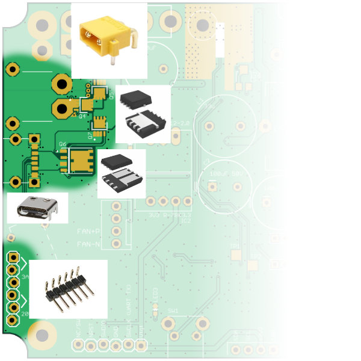

Populate power input MOSFETs, these PowerPAK MOSFETs are hand soldered with a soldering iron (not hot air). For each of the three MOSFETs, follow these steps:

1. brush the bottom of the MOSFET with flux, brush the PCB footprint with flux
2. apply a **very thin** layer of solder to the center pad of the MOSFET footprint on the PCB (not the MOSFET itself)
3. brush some more flux onto the PCB footprint
4. solder pin 1 of the MOSFET to the PCB, ensuring it is on straight
5. solder pins 2, 3, 4 of the MOSFET onto the PCB
6. solder pins 5 thru 8 of the MOSFET all in one go, apply extra solder as the wicking action will pull solder underneath the MOSFET (this is why we prepped the center pad first)

Populate the USB-C connector, followed by the XT30 connector

Populate JP5, which is the header for the shunt jumpers that configures USB-PD negotiation

Test input power. First test XT30 connector and check if the ideal-diode works. I recommend using a smoke-stopper device for this test if using a battery, otherwise, use a non-battery DC input with a XT30 connector.

Then test USB-C negotiation with a variety of configurations (20V vs 28V, 5A limit vs automatic current limit)

During the USB-C tests, the shunt jumpers should have been installed to JP5

(OPTIONAL) Populate LEDs. If you choose to do this, it might be nice to use different colours for each one.

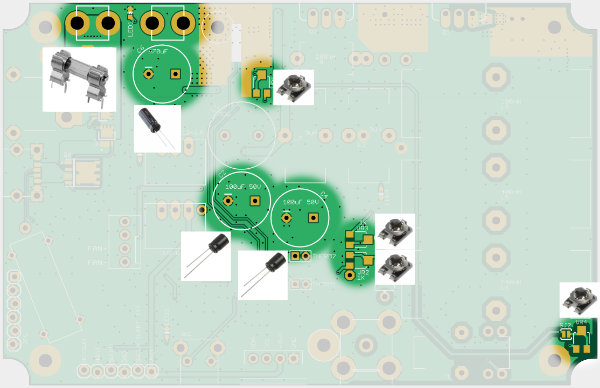

Populate the potentiometers. (DEVELOPMENT ONLY) Make note of their orientation and correlate spin direction with resistances.

Populate the fuse holder, and install a 7A fuse (20x5mm glass fast-blow fuse). Do a quick check to make sure it doesn't blow a fuse immediately.

Populate all through hole capacitors

## Testing Note: Voltage Measurement Points

[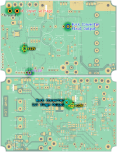](../doc/imgs/voltage_measurement_nodes_800.png)

## 2. Power Supplies

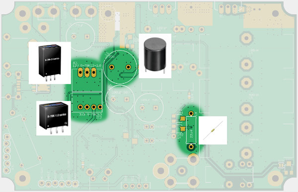

Populate the 12V buck converter. Populate the 3.3V buck converter (or voltage regulator).

Test the output of these buck converters (and/or voltage regulator). Power up the circuit using a current limited power supply of some kind (test condition: 20V input, 1A limit), and measure the 12V and 3.3V nodes using a multimeter, making sure they are measuring very close (within +/- 5%) to 12V and 3.3V.

Populate the L1 inductor. This is the main buck converter's first stage inductor.

Now, when powered up, the main buck converter will start outputting some voltage. Adjust the potentiometer to vary the voltage, test up to the limit, then set it to the lowest possible setting.

Populate the L9 inductor. This is the filter inductor for the tip detector.

## 3. PCB Cooling and Mounting Hardware

Add the custom cut copper fins to the buck converter heat dissipation area. Using 0.5mm thick copper sheets, cut strips that are about 5mm tall, and then cut them into small fins. Solder these fins to the top side of the PCB where the copper is exposed, near where buck converter is under, which is also near where one of the standoff screws is supposed to go. Arrange them such that the fins are perpendicular to the edge of the board as we want the air to flow outwards towards vents that are on the side of the box.

Do not make the fins block the area where the brass standoff and screw is supposed to go! We are soldering on the fins first before the standoffs are attached because it is easier to solder this way, without the huge thermal mass of the standoff.

Attach all brass standoffs (M2.5 thread, 6mm long, 4.5mm hex) to the bottom of the circuit board, using M2.5 x 4mm screws. Use low or medium strength thread-locker if available. Using tooth-lock washers is also optional.

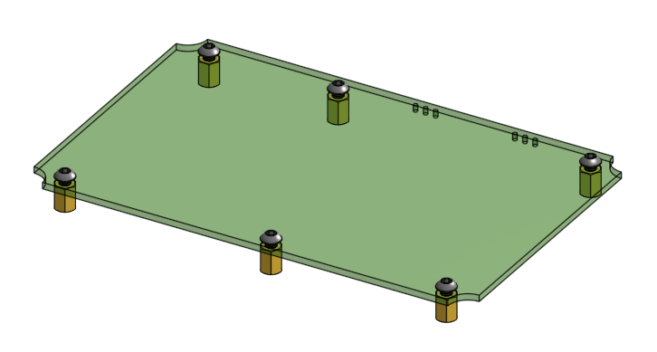

## 4. Controls and Firmware Bring-Up

Populate tactile button, OLED screen, coax connector

Populate the fan connector

Populate the debug header. It is a 6 pin female header with 0.1 inch pin pitch on the bottom of the circuit board.

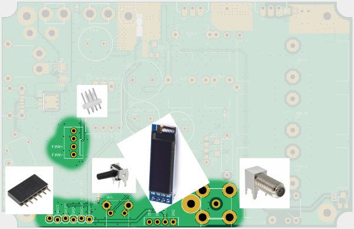

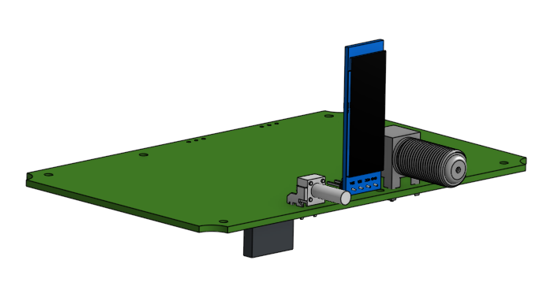

Configure the fan solder jumpers (SJ3, SJ4, SJ5), these are on the bottom of the PCB.

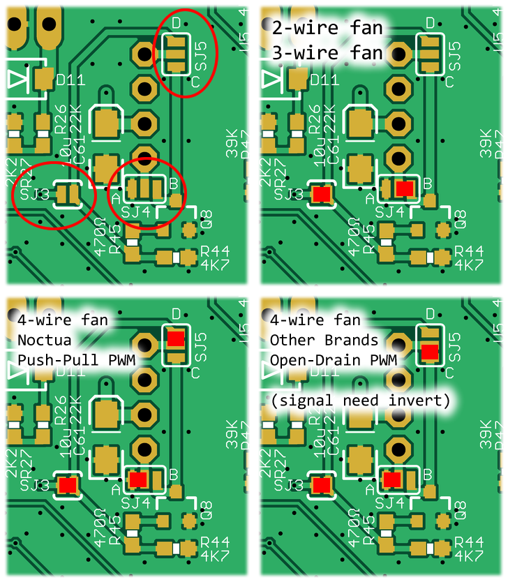

Ensure **SJ1** is bridged (ie. shorted) by solder.

At this point in the build process, you need to flash the firmware to the microcontroller

TODO: link to another page on firmware flashing

(DEVELOPMENT ONLY) Test firmware as much as possible, see all bring-up tests

## 5. Custom Inductors

Wind custom inductors (way more detailed instructions)

(DEVELOPMENT ONLY) measure custom wound inductor for inductance

Populate all custom wound inductors and transformer.

(DEVELOPMENT ONLY) Sanity check buck converter voltage isn't affected by power factor detector circuit

## 6. Solder/Measurement Jumpers

Either short out with solder, or populate **SJ6** with a 0.01 ohm measurement resistor, which is used to measure drain current of Q1.

If SJ6 is not used for measurements, then also short out **SJ7** with solder.

**SJ8** is used to measure the current consumption of the 12V rail, to determine the gate driver's efficiency. The tuning happens after the MOSFETs are ready. Short it out with solder if you are not performing this measurement.

## 6. Printed Parts and Templates

3D print all drilling and cutting templates

3D print: face plate, air intake grille, air exhaust duct, internal air blockers

3D printing material is PETG, or really anything that is more temperature resistant than PLA. Do not use PLA.

Everything can be 3D printed using a 0.4mm or 0.6mm nozzle.

## 7. Enclosure Preparation

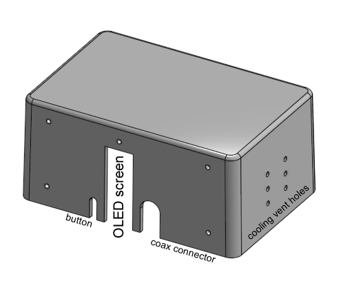

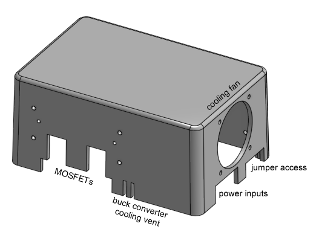

Drill and cut enclosure box and lid. Use the cutting and drilling templates to help. Thread tap enclosure box where needed. Please refer to diagram.

(note: all holes start off with a 2.5mm drill bit, and if needed, a larger drill bit is used after)

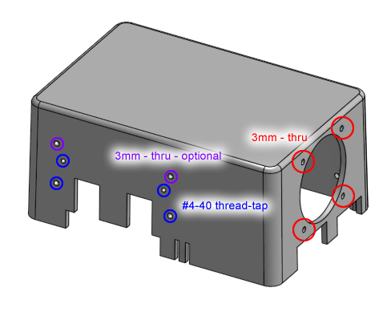

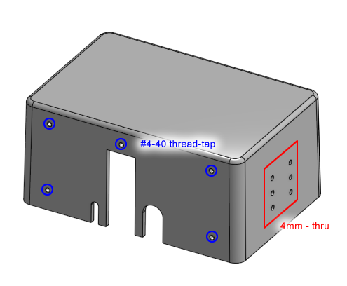

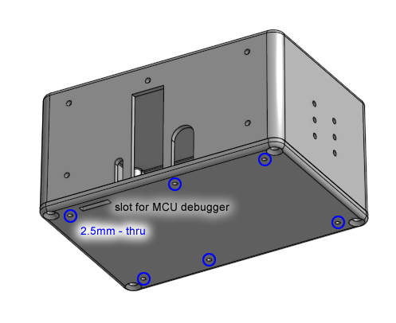

The holes for the face plate are not a part of the drilling template. Instead, the face plate itself is used as the drilling template. These holes are thread-tapped for #4-40 screws. The face plate will be fastened as the very last step of the whole build.

Perform an inspection of 3D printed parts and make sure they fit on the enclosure, such that the cutouts are the right size and in the right positions. Additional cutting, grinding, and/or filing, maybe required to make adjustments. Ensure the face plate lines up, and the tactile button, OLED screen, and coaxial connector all line up when the box is dropped over the circuit board when the circuit board is attached to the bottom box lid.

Clean all metal shavings, debur all drilled and cut edges, dull all sharp edges.

## 8. Power MOSFET and Heatsink Assembly

Drill and thread tap the heatsink. A 3D printed drilling template is provided. The thread tap is for a #4-40 thread.

Cut some of the fins off the heatsink where screws will sit over.

Debur the cuts and clean any metal shavings from heatsink.

Clean the surface of the heatsink and the back of both MOSFETs with rubbing alcohol.

Place a silicone thermal pad between each MOSFET and the heatsink.

Insert a nylon shoulder washer (for #4 screws with 3.7mm OD and 2mm depth) into the TO-220 tab's hole.

Fasten the MOSFET to the heatsink using a #4-40 x 3/8 inch long screw through the nylon shoulder washer.

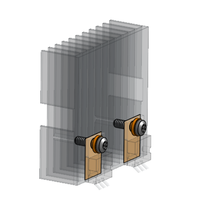

Before tightening completely, make sure the MOSFET legs are aligned with their perspective footprints on the circuit board. Tighten the screw completely after alignment is ensured.

Cut off the excess silicone thermal pad with an Xacto knife.

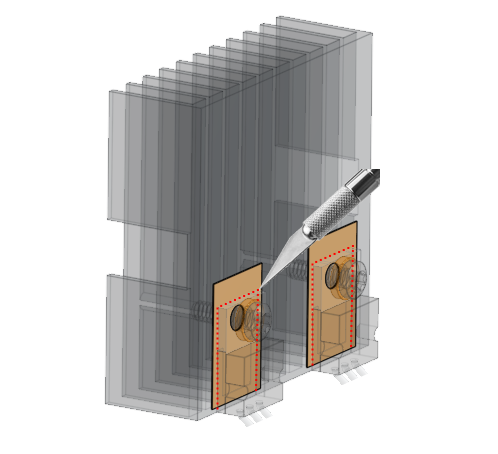

Check to make sure heatsink is not causing continuity problems. The drain tab of each MOSFET must not be conductive with the heatsink, nor with each other.

Bend the MOSFET legs, refer to the diagram. The goal is so that the heatsink can mate with the box's face once the box is dropped down on the circuit board.

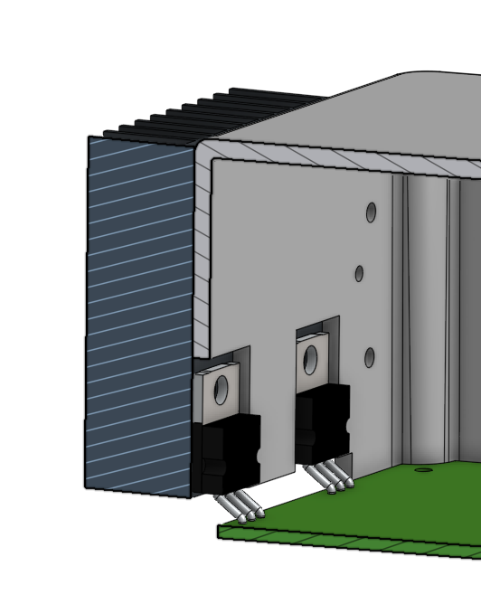

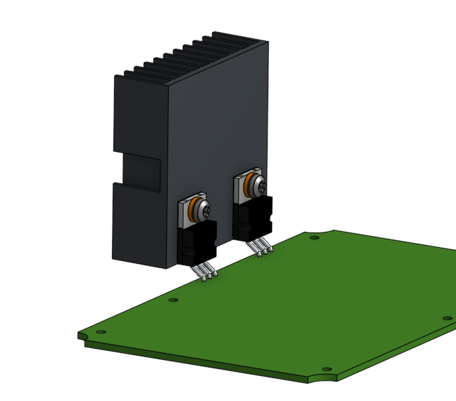

Solder MOSFETs to PCB, continue to adjust the angle of the MOSFET's legs as needed.

Wire up the NTC thermistors and attach them to the MOSFET's plastic face. First, ziptie the wires of the NTC thermistors to the drain leg of the MOSFET. Then, use high temperature epoxy to adhere the bead of the NTC thermistor to the surface of the MOSFET. Please refer to photograph.

Perform mandatory safety related firmware tests (tip detection, NTC thermistors, warning near 8S input voltages). These tests are to be done under unlimited current input power (the glass fuse is the protection now), but the buck converter should be set to a low setting.

(DEVELOPMENT ONLY) full functionality testing while not enclosed, tune the air-core inductor in the gate driver circuit, perform burn-in tests, see detailed test plan

## 9. Final Assembly

**Perform a final review of all soldering, including test points, test resistors, solder jumpers.**

Fasten PCB to bottom lid, using the brass standoffs installed previously and M2.5 x 4mm screws.

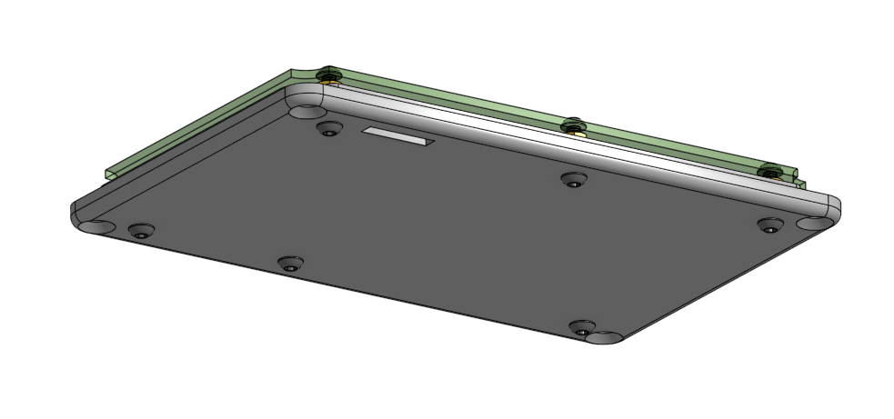

Assemble cooling fan and the air intake grille to the box. See diagram for details.

Clean the heatsink surface and the surface of the box where it will sit, use rubbing alcohol.

Apply thermal paste to the box where the heatsink will sit

Plug in the fan to the circuit board

Drop the box over the whole assembly

Secure the heatsink with #4-40 screws and M3 washers

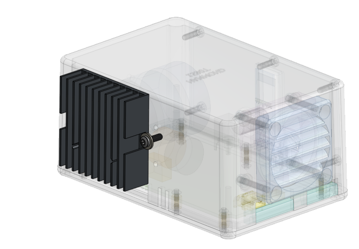

Clean up thermal paste that got squished out

Fasten on the air exhaust duct, using #4-40 screws

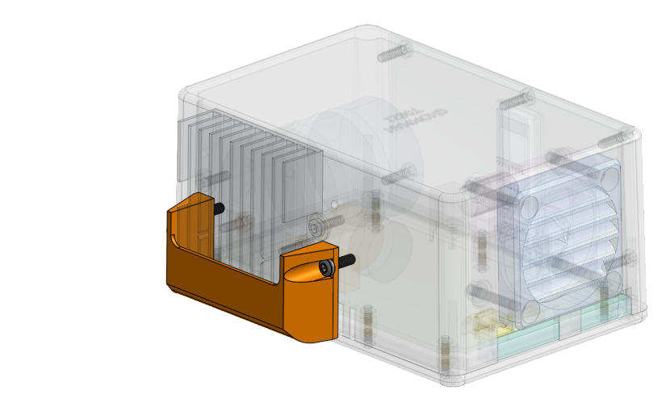

Fasten on the face plate, using #4-40 screws

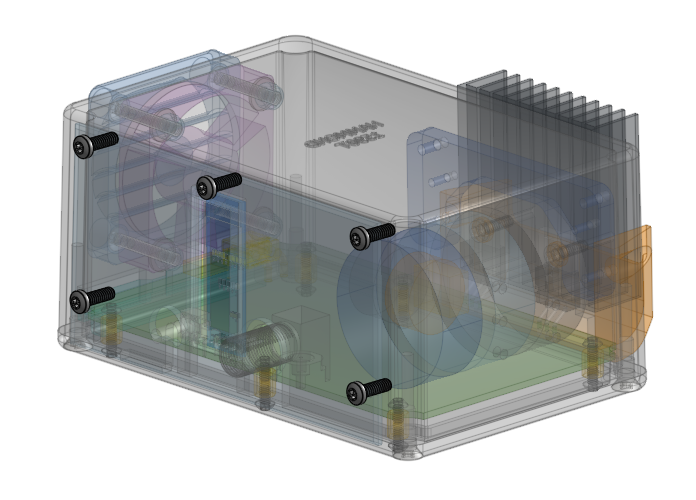

Stick on some rubber feet to the bottom of the enclosure.

## 10. Enclosed Development

(DEVELOPMENT ONLY) further firmware development
