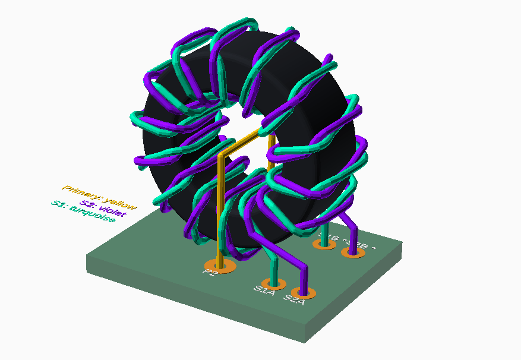
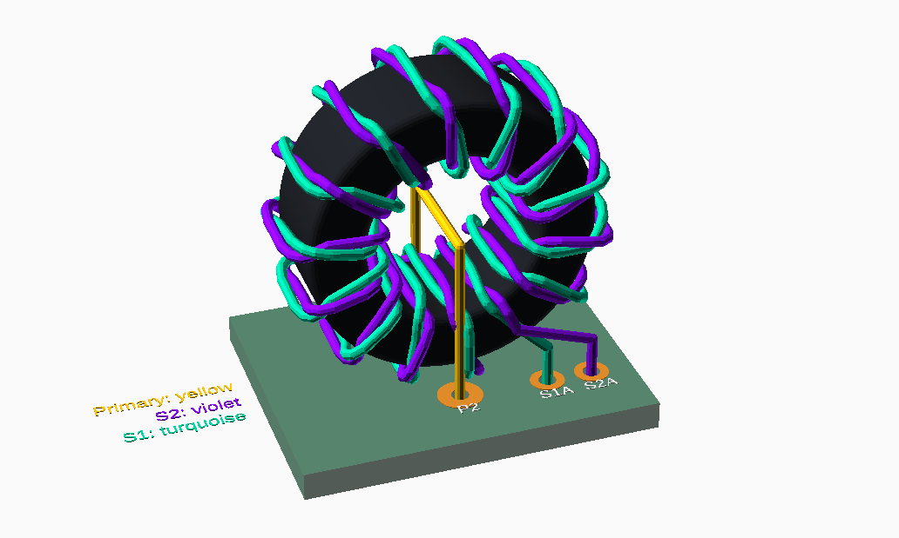

# Custom Inductors

Make sure you are familiar with how to use enamel coated magnet wire correctly, how to prepare the ends of the wires for soldering, etc.

Remember that, one "turn" is defined as passing through the center of the toroid once. It doesn't have to be a complete loop.

## 9 uH choke

Both small custom inductors use the Fair-Rite 5961004901 toroid core, and 22 AWG solid core enamel coated wire (aka magnet wire).

For the 9uH choke, use 10 turns.

Equation for wire length: `(2 * 10) + T * (2 * ((16 - 9.6) / 2 + 6.35) + pi * 0.644) * 1.05`

10 turns should be 242 mm of wire.

If you actually managed to get a `K16x8x6` identical to the one SergeyMax used, then use 15 turns.

## Current transformer

The ratio is 1:14:14

Uses the Fair-Rite 5961004901 toroid core and 22 AWG wire.

The primary (the 1 in 1:14:14) is just a single wire crossing the inside of the toroid once. No crossing on the bottom/outside of the toroid.

The wire length of each secondary should be about 355 mm. (there is an additional +8% to account for the twisting of the two wires)

Twist these two secondary wires together first, evenly, then wrap the result around the toroid 14 times. Do not cause these wires to cross while wrapping around the toroid.

Reference the following 3D model:

## Large inductors

The three large inductors are using the Amidon T130-6 toroid cores and 16 AWG solid core enamel coated wire.

Equation for wire length: `(2 * 10) + T * (2 * ((33 - 19.8) / 2 + 11.1) + pi * 1.29) * 1.05`

180 uH -> 4 turns -> 186 mm

400 uH -> 6 turns -> 269 mm

540 uH -> 7 turns -> 310 mm

## Coreless inductor L8

Use 10 turns of 22 AWG wire, wound around a 5 mm dowel or similar mandrel. Make the coil approximately 10 mm wide, then squeeze or stretch it during tuning.

Using a 5 mm inside diameter, a 0.644 mm wire diameter, a 1 mm pitch, two 10 mm leads, and 5% extra wire for winding tolerance, the approximate cut length in millimeters is:

`(2 * 10) + 10 * sqrt((pi * (5 + 0.644))^2 + (10 / 10)^2) * 1.05`

This gives approximately 207 mm, so cut about 210 mm of wire before winding.

## Total wire used

The totals below use the rounded cut lengths given above. The values calculated directly from the equations are within about 5 mm of these totals.

For 22 AWG:

`210 + 242 + 242 + 355 + 355 = 1404 mm = 1.404 m = 4.6 ft`

This includes L8, both 9 uH chokes, and both current-transformer secondaries. It does not include the current transformer's short one-turn primary; reserve at least another 50 mm for it. The resulting planned requirement is approximately 1.41 m or 4.62 ft.

For 16 AWG:

`186 + 269 + 310 = 765 mm = 0.765 m = 2.51 ft`

For one complete unit, the practical minimum purchase is 1.5 m (5 ft) of 22 AWG and 1 m (3.3 ft) of 16 AWG. To leave enough wire for trimming mistakes or rewinding an inductor, buy approximately 3 m (10 ft) of 22 AWG and 1.5 m (5 ft) of 16 AWG.
