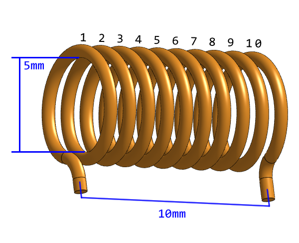

# Custom Inductors

Make sure you are familiar with how to use enamel coated magnet wire correctly, how to prepare the ends of the wires for soldering, etc.

Remember that, one "turn" is defined as passing through the center of the toroid once. It doesn't have to be a complete loop.

## 9 uH choke

Both small custom inductors use the Fair-Rite 5961004901 toroid core, and 22 AWG solid core enamel coated wire (aka magnet wire).

For the 9 uH choke, use 13 turns. The A_L of this toroid core is 80 +/- 25%, 13 turns is worst case 10.14 uH. Ending up with a slightly higher than specified inductance for these 9 uH chokes is not the end of the world.

Equation for wire length: `(2 * 13) + T * (2 * ((16 - 9.6) / 2 + 6.35) + pi * 0.644) * 1.05`

13 turns should be 315 mm of wire. I highly recommend cutting sections of 350 mm to make it easier to pull.

If you actually managed to get a `K16x8x6` identical to the one SergeyMax used, then use 15 turns as per original instructions.

## Current transformer

The ratio is 1:14:14

Uses the Fair-Rite 5961004901 toroid core and 22 AWG enamel coated wire.

The primary (the 1 in 1:14:14) is just a single wire crossing the inside of the toroid once. No crossing on the bottom/outside of the toroid.

I recommend cutting off about 3 feet of 22 AWG enamel coated wire, and then folding all of it exactly in half as if it was a pair of wires, then twisting the pair together, evenly.

Then wrap the twisted-pair around the toroid 14 times. Do not cause these wires to cross while wrapping around the toroid.

Reference the following 3D model:

You need to use a multimeter to confirm which wire is which before soldering the wire ends into the PCB.

## Large inductors

The three large inductors are using the Amidon T130-6 toroid cores and 16 AWG solid core enamel coated wire.

Equation for wire length: `(2 * 10) + T * (2 * ((33 - 19.8) / 2 + 11.1) + pi * 1.29) * 1.05`

180 uH -> 4 turns -> 186 mm

400 uH -> 6 turns -> 269 mm

540 uH -> 7 turns -> 310 mm

## Coreless inductor L8

Use 10 turns of 22 AWG wire, wound around a 5 mm dowel or similar mandrel. Make the coil approximately 10 mm wide, then squeeze or stretch it during tuning.

Using a 5 mm inside diameter, a 0.644 mm wire diameter, a 1 mm pitch, two 10 mm leads, and 5% extra wire for winding tolerance, the approximate cut length in millimeters is:

`(2 * 10) + 10 * sqrt((pi * (5 + 0.644))^2 + (10 / 10)^2) * 1.05`

This gives approximately 207 mm, so cut about 210 mm of wire before winding.

## Securing the Inductors

Custom inductors are commonly secured with neutral-cure, electronics-grade RTV silicone, which remains flexible and is relatively easy to remove, or with two-part epoxy when a rigid, permanent bond is wanted. Avoid acid-cure RTV silicone, recognizable by its vinegar smell, because it can corrode copper and electronics. Avoid hot-melt glue as it is very possible for this circuit to get hot.
