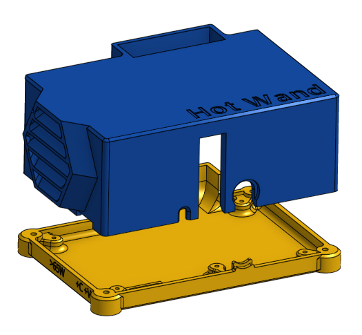
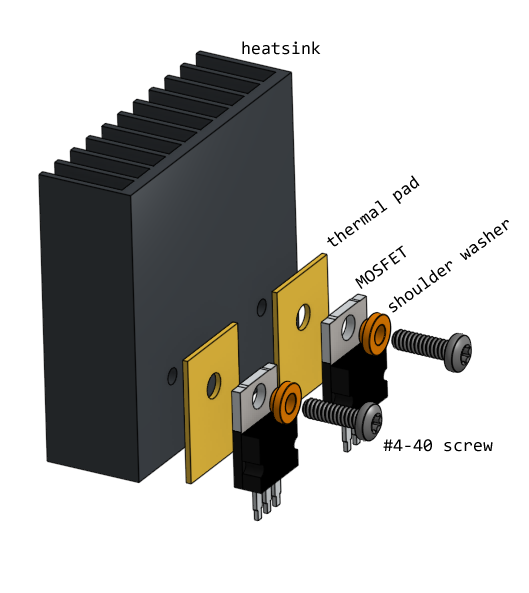
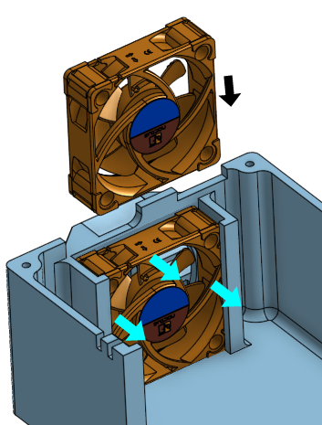
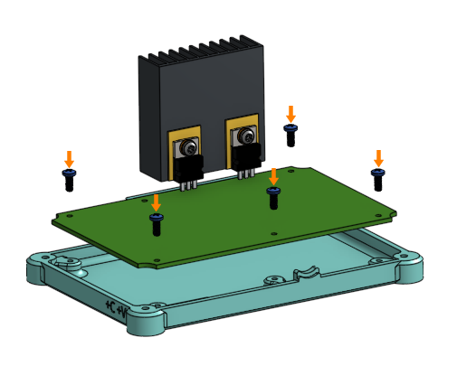
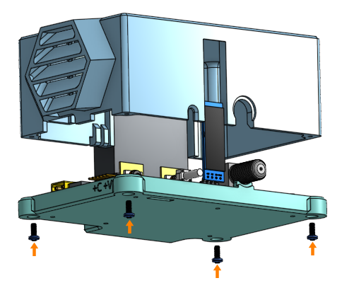

# Economy Build for Hot Wand 13.56 MHz version

There's a way to build the 13.56 MHz version of Hot Wand for cheap, using a 3D printed enclosure and skipping a lot of components.

Due to the lack of an aluminum enclosure, this design relies heavily on the cooling fan for cooling. It also does not provide an RF shield between the inside and outside.

If you wish to build this way, then you need to be smart and pay attention to both documents to figure out what to buy and what not to buy.

Do not buy any of the brass standoffs.

Do not buy the aluminum enclosure.

The screws used are `M2.5 x 8mm` and `#4-40 x 3/8 in`. There are no nuts or washers required at all.

Do not buy thermal paste, it is not needed.

You do still need to make the custom heatsink fins for the buck converter out of the copper sheet.

Note: This design only works for a heatsink that is 45mm x 45mm x 15mm, `HSB21-454515`. This heatsink is cheaper on Digi-Key than ones on Amazon even in bulk.

## 3D Printed Box

The box is designed as two pieces. 3D print them both out a temperature resistant material, such as PETG. See [this directory for the files you need](../../mechanical/econo)

* Box Body
* Bottom Lid
* Heatsink Drilling Template

The heatsink needs a drilling template, you can print this out of PLA because it'll be thrown away after you are done.

## MOSFET and Heatsink Mounting

Drill and thread tap the heatsink. A 3D printed drilling template is provided. The thread tap is for a #4-40 thread. Remember to place the template correctly such that the final result would be optimized for upward airflow.

Cut some of the fins off the heatsink where screws will sit over.

Debur the cuts and clean any metal shavings from heatsink.

Clean the surface of the heatsink and the back of both MOSFETs with rubbing alcohol.

Place a silicone thermal pad between each MOSFET and the heatsink.

Insert a nylon shoulder washer (for #4 screws with 3.7mm OD and 2mm depth) into the TO-220 tab's hole.

Fasten the MOSFET to the heatsink using a #4-40 x 3/8 inch long screw through the nylon shoulder washer.

DO NOT FORGET THE NYLON SHOULDER WASHERS! Or else you blow up your circuit as you short circuit the drain tab to ground.

Before tightening completely, make sure the MOSFET legs are aligned with their perspective footprints on the circuit board. Tighten the screw completely after alignment is ensured.

Check to make sure heatsink is not causing continuity problems. The drain tab of each MOSFET must not be conductive with the heatsink, nor with each other.

The MOSFET legs do NOT need to be bent.

See original instructions about attaching the thermistors.

## Fan Installation

The fan is inserted into the plastic enclosure and held in place using hot glue. No fasteners are used. The design has the fan resting on the XT30 connector, so there's no fear of it moving even if there are no fasteners.

Make sure the airflow direction is into the box.

Plug in the fan before closing the box.

## Screwing the PCB Down

**Perform a final review of all soldering, including test points, test resistors, solder jumpers.**

Clean the entire PCB, using an antistatic brush and rubbing alcohol.

At this point, you may apply conformal coating over the circuit board if you wish.

Use **five** M2.5 x 8mm screws to screw down the PCB. Brass standoffs are not used. The screw near the F-type coax connector is installed, the screw near the buck converter is not installed.

(alternatives: #2 x 5/16" thread forming screws or sheet metal screws or plastite screws, M2.5 x 8mm plastite screws)

Plug in the fan before closing the box.

## Final Box Closure

Use M2.5 x 8mm screws to fasten the enclosure box to the enclosure bottom lid.

