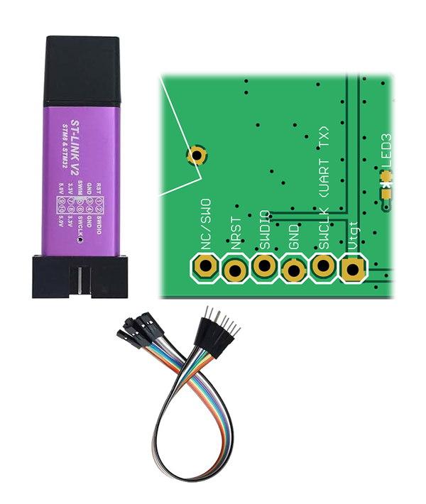

# Firmware Flashing

The microcontroller is a STM32F042. On the circuit board, there is a 6 pin debug header with the necessary SWD signals for firmware flashing. The signals are labelled on the circuit board.

The assembly specifies that a 6 pin female header is installed to the bottom of the PCB at this location. This allows the debug port to be accessed even when the Hot-Wand device is fully enclosed. This means it is easier to use male-to-female dupont jumper wires to make the connection between the debugger and our circuit board.

The firmware file is available as a `*.hex` file to download and flash directly.

The easiest tool to use for firmware flashing is a ST-Link V2 (or V3). This tool is most easily used with ST's own[STM32CubeProgrammer software (click here for ST's page to download)](https://www.st.com/en/development-tools/stm32cubeprog.html).

You can purchase a cheap ST-Link V2 from online retailers very easily. If you own a STM32 development board, you can also use the on-board ST-Link that is built into those development boards.

You might own a dedicated JTAG/SWD debugger device, such as a Segger J-Link, Keil ULINK, or [Black Magic Debug](https://black-magic.org/), in which case, I will leave it up to you on how to perform the flashing.

## Instructions for STM32CubeProgrammer

Wire up the debugger, make the connections

1. GND / ground
2. Vtgt or 3.3V
3. SWDIO
4. SWCLK
5. NRST or RST

The other remaining 6th signal is not connected.

Connect the debugger to your computer using a USB cable.

Run `STM32CubeProgrammer`.

Power on the Hot-Wand, using your preferred power input method. (be smart about it, if you can use one with a current limit, then use a 0.5A current limit)

Click on `Connect` inside `STM32CubeProgrammer`. The GUI should populate with some information about the current microcontroller, indicating that it is a `STM32F042`.

<!-- Insert screenshot of a successful STM32CubeProgrammer connection here. -->

Open the `Erasing & Programming` page using the navigation on the left side of the window.

Under `File path`, browse to and select the downloaded firmware `*.hex` file. The addresses required for programming are contained in the hex file, so no start address needs to be entered manually.

Enable the option to verify the programmed data after writing, if it is available in the installed version of STM32CubeProgrammer.

Click `Start Programming` or `Download`, depending on the version of the software. Wait for both the programming and verification operations to complete successfully. Do not disconnect the debugger or remove power while this operation is in progress.

<!-- Insert screenshot of the selected firmware file and programming controls here. -->

<!-- Insert screenshot of the successful programming and verification message here. -->

Click `Disconnect`, close STM32CubeProgrammer, and then remove power from the Hot-Wand. Disconnect the USB cable and jumper wires after the target is no longer powered.

Power the Hot-Wand normally. The device should start using the newly programmed firmware.

## Firmware Updating

You can update the firmware using the same procedure. But, as SJ3 is connected, the debug signal will cause the fan to do weird things.

## Troubleshooting

If STM32CubeProgrammer cannot connect to the microcontroller, check the following:

1. Confirm that `GND`, `SWDIO`, `SWCLK`, and `NRST` are connected to the matching signals on the debugger.
2. Confirm that the target is powered and that the debugger can detect the target voltage.
3. Confirm that the ST-Link is selected as the connection interface.
4. Reduce the SWD connection frequency and try connecting again.
5. Select the option to connect while the target is held in reset, if that option is available, and try again.
6. Disconnect and reconnect the debugger USB cable, then restart STM32CubeProgrammer.

If programming completes but verification fails, repeat the operation once after checking the connections and power supply. If it continues to fail, perform a full chip erase and then program the firmware file again. A full chip erase removes the existing firmware and any settings stored in the microcontroller's flash memory.

If the device does not start after a successful programming operation, remove power completely, wait a few seconds, and power it again. If the problem remains, reconnect the debugger and confirm that the programming and verification operations complete without errors.

## Note for Firmware Development

Be extremely careful in regards to the RF signal generation. That pin must never be left in a high state. When left in a high state, the MOSFET of the RF amplifier will be turned on, and if left on for too long, it represents a short circuit as flat DC voltage starts to flow through it.

This means never halting the code unexpectedly while RF signal generation is active. Do not pause at a breakpoint, single-step through the RF generation code, or otherwise stop the processor while the RF output pin may be high. A debugger can halt the CPU without changing the state of its GPIO pins, leaving the last output level applied indefinitely.

Before pausing or resetting the microcontroller during development, first disable RF generation and confirm that the output pin has returned to a low state. Firmware should also configure this pin as a low output as early as possible during startup and force it low before entering an error state, shutdown sequence, or other condition that may prevent normal signal generation from continuing. Treat unexpected faults and infinite loops in the RF generation path as potentially unsafe, since software protection cannot change the pin state after the processor has been halted by a debugger.
