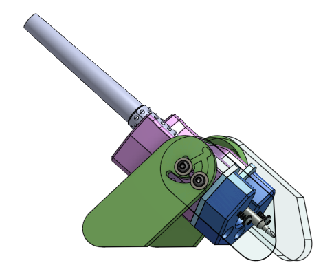
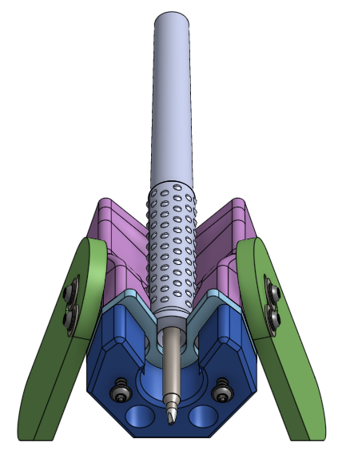
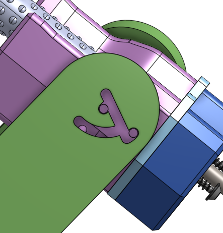
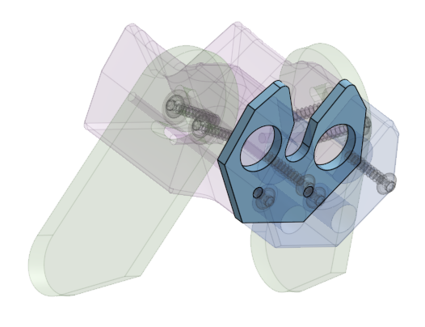

# Soldering Iron Handpiece Stand

This soldering iron stand fits any handpiece that has a 16mm flange, which is common for RF soldering iron handpieces. It can contain magnets that put RF soldering iron cartridges into sleep mode. It is primarily designed to be portable with folding legs to stand it up, but it can also be mounted as a part of a heavier duty iron stand.

It consists of mostly 3D printed components and one aluminum plate that is supposed to be cut by SendCutSend (or similar).

The pieces are named:

* Handle Rest
* Aluminum Strike Plate
* Tip Shroud
* Left Foot, Right Foot

It can house cylindrical magnets that are 1/2" in diameter and 1/4" thick, magnetized axially. (KJ Magnetics D84, D84AH, D84B-N52, etc)

The design has the aluminum strike plate intentionally taking possible hits from the hot soldering iron tip, preventing the plastic from getting melted accidentally. However it is still advised to cover exposed plastic surfaces with aluminum foil tape for added protection.

Assembly assumes to use M3 sized 16mm long plastite screws (McMaster-Carr `96817A107`) and M3 washers. You may substitute this as you wish, all the holes are a bit undersized in the design.

The design is available [at Onshape (click here)](https://cad.onshape.com/documents/cfeb2fa9b83109508c6ff5e8/w/69b4ef0849f116bf37eeaccd/e/969a8f9c953454fe4aa374bb), public export permissions have been enabled. Static exported files have been saved to [this directory in the repo](mechanical\iron-stand) as well.
