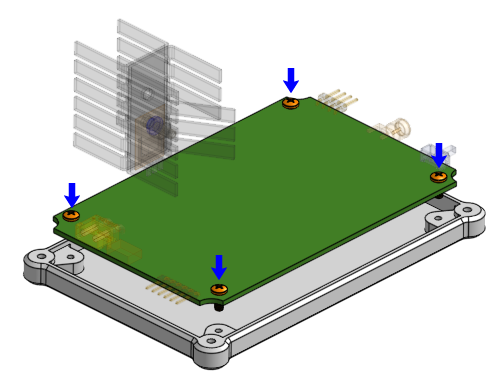
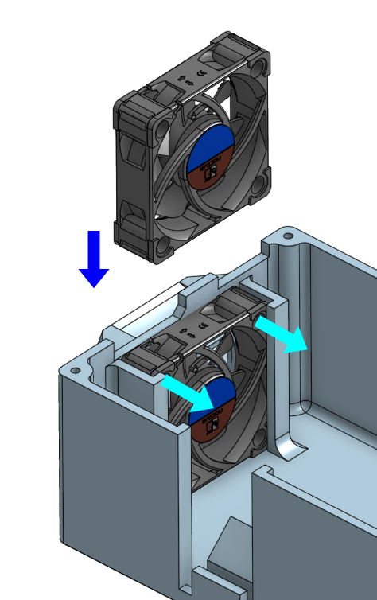
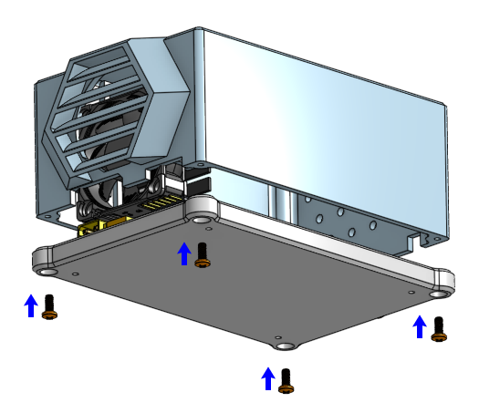

# Hot-Wand Lite 470 kHz Build Guide

## 0. Circuit Board Reception

Get the circuit board from JLCPCB with mostly bottom components already populated. [See this guide on ordering from JLCPCB](jlcpcb-ordering.md)

Populate all out-of-stock components that JLCPCB did not populate on the bottom side first. (this depends on what was available when the circuit board was ordered)

For all the other required parts, [see the shopping document (click here)](shopping.md)

## 1. Input Power

Populate power input MOSFETs, these PowerPAK MOSFETs are hand soldered with a soldering iron (not hot air). For each of the three MOSFETs, [follow these steps (click here for document)](./assembly-supplement.md#power-input-mosfets)

Populate the USB-C connector, followed by the XT30 connector

Populate JP5, which is the header for the shunt jumpers that configures USB-PD negotiation

Test input power. First test XT30 connector and check if the ideal-diode works. I recommend using a smoke-stopper device for this test if using a battery, otherwise, use a non-battery DC input with a XT30 connector.

Then test USB-C negotiation with a variety of configurations (20V vs 28V, 5A limit vs automatic current limit)

During the USB-C tests, the shunt jumpers should have been installed to JP5

## 2. Top Side Components

Make sure the components with polarity are installed correctly. The capacitors have a negative lead that is marked with a `-` symbol and a strip on the side.

The SMA coaxial connector is supposed to be soldered upside down, with the center pin on the bottom of the board.

(For revision `20260820A` only) The power switch needs to have a direction selected, to choose which side means "ON" and which side means "OFF". I leave this up to the user. Solder between one of these two locations to make the choice.

## 3. Microcontroller and Firmware Bring-Up

WARNING: NEVER flash firmware while the main input power is connected. You can also just remove the microcontroller module before flashing it.

Many microcontroller modules are compatible with this design:

 * Seeed Studio XIAO RP2040
 * Seeed Studio XIAO SAMD21
 * Seeed Studio XIAO ESP32-C3
 * Waveshare RP2040 Zero (needs to be installed upside down)
 * ESP32-C3 Super Mini

Solder male headers to the microcontroller module (the headers should have been included with the microcontroller module).

The microcontroller can be [flashed using Visual Studio Code and PlatformIO (click here for a guide)](firmware-flashing.md).

It is recommended to solder female headers onto the Hot-Wand-Lite PCB where the microcontroller module footprint is, and then plugging in the microcontroller module. This makes the microcontroller module removable.

## 4. Custom Inductors

There are 4 custom inductors in this design. [Follow the instructions on how to create them (click here)](custom-indoctors.md), and then solder them to their perspective locations.

(DEVELOPMENT ONLY) If a LCR meter is available, record the number of winds for each individual inductor and the resulting inductance.

## 5. MOSFET Heatsink

Assemble the MOSFET together with the heatsinks according to the diagrams:

The bottom 3 fins of the heatsink needs to be bent to avoid the 12V buck converter. You must do this before soldering.

Then solder the MOSFET to the circuit board.

WARNING: do NOT ever use the heatsink or the TO-220 as a ground, it is not ground, it is the drain of the MOSFET carrying high RF voltage.

## 6. Solder Jumpers

SJ1, SJ2, SJ3, SJ4, SJ5 are all meant for a developer to measure the ground return current. For normal use, these all need to be bridged (ie shorted-out) with solder.

(DEVELOPMENT ONLY) At this point, full testing can happen, as long as tests are short enough as to not require a cooling fan.

## 7. 3D Printed Box

3D print the box, consisting of two parts: the body, and the bottom. Avoid using PLA for this, use something that can stand a bit more temperature. The design is meant to be printed without any supports.

[Find the files required here (click here)](../../mechanical/lite)

(note: if you want a more expensive premium metal build, the Lite version PCB is compatible with the aluminum enclosure that the 13.56 MHz version uses, and you will need the brass standoffs, and the heatsink stack needs to be insulated from the MOSFET)

## 8. Final Assembly and Testing

**Perform a final review of all soldering, including test points, test resistors, solder jumpers.**

Clean the entire PCB, using an antistatic brush and rubbing alcohol.

At this point, you may apply conformal coating over the circuit board if you wish.

Fasten PCB to bottom lid using four M2.5 x 6mm screws.

Insert the cooling fan into the slot for the fan. Make sure the direction of airflow is towards the inside of the box. The fan should not need any fasteners, but you can use a small amount of hot glue to hold it in place (it will sit on the XT30 connector).

Plug in the fan, making sure the polarity is correct.

Drop the box over the whole assembly. The heatsink might touch the box, that's ok. Use four M2.5 x 6mm screws to fasten the bottom lid to the box body.

## Handpiece

#### If using: Radio Thermal Handpiece

Radio Thermal provides instructions on making a cheap handpiece, [please see their instructions](https://github.com/RadioThermal/RadioThermal_Soldering_OSHW/tree/main/Handpiece)

When finished, you can just connect the it to the SMA connector

#### If using: Thermaltronics Handpiece

Thermaltronics still sells their older SHP-K handpieces (meant for 470 kHz cartridges) for about $50 dollars, but they have a weird big connector. You can either cut off the connector and solder on a SMA connector, or make some sort of adapter by yourself.

## Iron Stand

Please see [this page about my 3D printed folding soldering stand](../build-guide-iron-stand.md)

