# Hot-Wand Lite 470 kHz Build Guide

## 0. Circuit Board Reception

Get the circuit board from JLCPCB with mostly bottom components already populated. [See this guide on ordering from JLCPCB](jlcpcb-ordering.md)

Populate all out-of-stock components that JLCPCB did not populate on the bottom side first. (this depends on what was available when the circuit board was ordered)

For all the other required parts, [see the shopping document (click here)](shopping.md)

## 1. Input Power

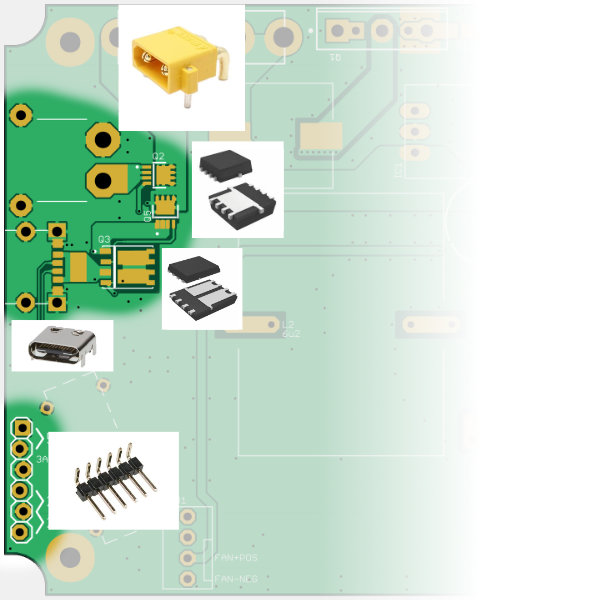

Populate power input MOSFETs, these PowerPAK MOSFETs are hand soldered with a soldering iron (not hot air). For each of the three MOSFETs, [follow these steps (click here for document)](./assembly-supplement.md#power-input-mosfets)

Populate the USB-C connector, followed by the XT30 connector

Populate JP5, which is the header for the shunt jumpers that configures USB-PD negotiation

Test input power. First test XT30 connector and check if the ideal-diode works. I recommend using a smoke-stopper device for this test if using a battery, otherwise, use a non-battery DC input with a XT30 connector.

Then test USB-C negotiation with a variety of configurations (20V vs 28V, 5A limit vs automatic current limit)

During the USB-C tests, the shunt jumpers should have been installed to JP5

## 2. Top Side Components

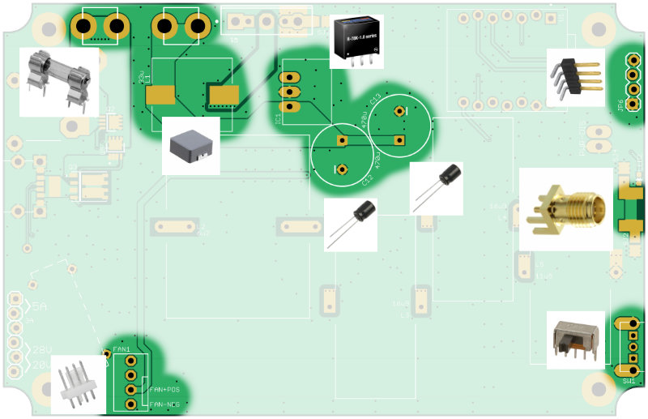

Make sure the components with polarity are installed correctly. The capacitors have a negative lead that is marked with a `-` symbol and a strip on the side.

The SMA coaxial connector is supposed to be soldered upside down, with the center pin on the bottom of the board.

(For revision `20260820A` only) The power switch needs to have a direction selected, to choose which side means "ON" and which side means "OFF". I leave this up to the user. Solder between one of these two locations to make the choice.

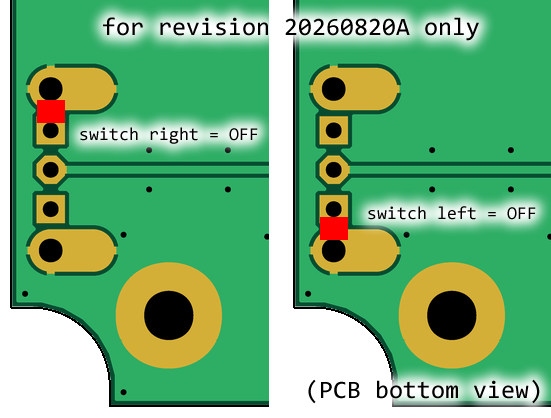

## 3. Microcontroller and Firmware Bring-Up

WARNING: NEVER flash firmware while the main input power is connected. You can also just remove the microcontroller module before flashing it.

Many microcontroller modules are compatible with this design:

 * Seeed Studio XIAO RP2040
 * Seeed Studio XIAO SAMD21
 * Seeed Studio XIAO ESP32-S3
 * Seeed Studio XIAO ESP32-C3
 * Waveshare RP2040 Zero (needs to be installed upside down)

Solder male headers to the microcontroller module (the headers should have been included with the microcontroller module).

The microcontroller can be [flashed using Visual Studio Code and PlatformIO (click here for a guide)](firmware-flashing.md).

It is recommended to solder female headers onto the Hot-Wand-Lite PCB where the microcontroller module footprint is, and then plugging in the microcontroller module. This makes the microcontroller module removable.

## 4. Custom Inductors

There are 4 custom inductors in this design. [Follow the instructions on how to create them (click here)](custom-indoctors.md), and then solder them to their perspective locations.

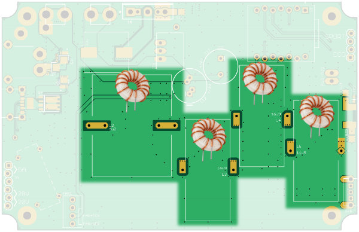

(DEVELOPMENT ONLY) If a LCR meter is available, record the number of winds for each individual inductor and the resulting inductance.

## 5. MOSFET Heatsink

Assemble the MOSFET together with the heatsinks according to the diagrams:

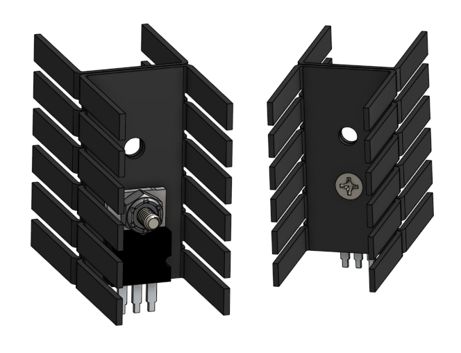

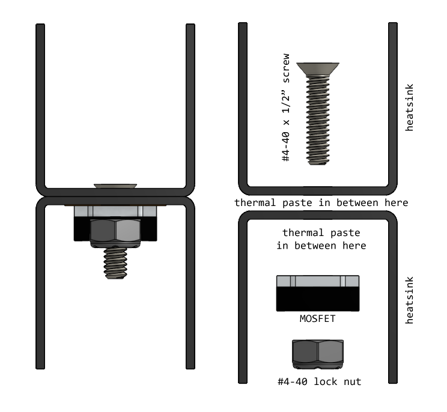

The bottom 3 fins of the heatsink needs to be bent to avoid the 12V buck converter. You must do this before soldering.

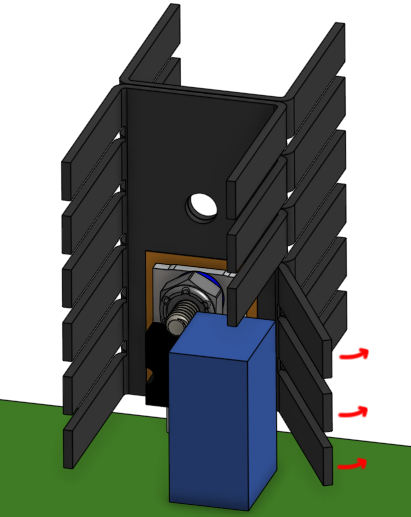

Then solder the MOSFET to the circuit board.

Using a multimeter, ensure that the MOSFET's drain tab is not continuous with the screw or heatsink.

WARNING: do NOT forget the thermal pad or the shoulder washer, as without them you can cause a catastrophic high energy short circuit to ground when the circuit is powered up.

## 6. Solder Jumpers

SJ1, SJ2, SJ3, SJ4, SJ5 are all meant for a developer to measure the ground return current. For normal use, these all need to be bridged (ie shorted-out) with solder.

(DEVELOPMENT ONLY) At this point, full testing can happen, as long as tests are short enough as to not require a cooling fan.

## 7. Mounting Hardware

Attach all brass standoffs (M2.5 thread, 6mm long, 4.5mm hex) to the bottom of the circuit board, using M2.5 x 4mm screws. Align the one of the flat faces of the hexagonal standoff parallel to the nearest edge of the PCB. Use low or medium strength thread-locker if available. Using tooth-lock washers is also optional and can help.

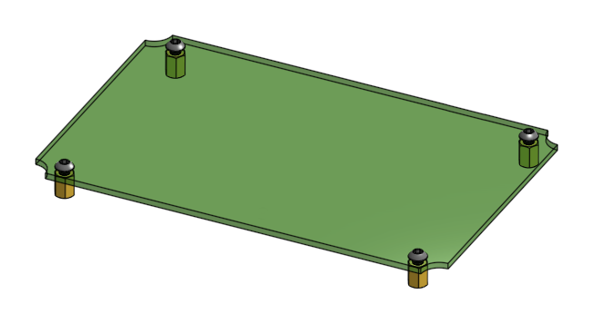

## 8. Printed Parts and Templates

3D print: air intake grille

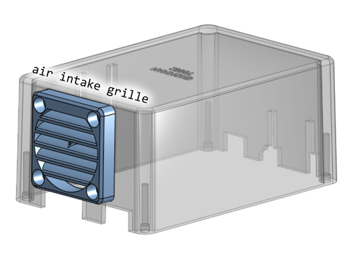

3D printing material is PETG, or really anything that is more temperature resistant than PLA. Do not use PLA.

Everything can be 3D printed using a 0.4mm or 0.6mm nozzle. Everything is designed to be printable without supports.

3D print all drilling and cutting templates. These are to be printed using PLA.

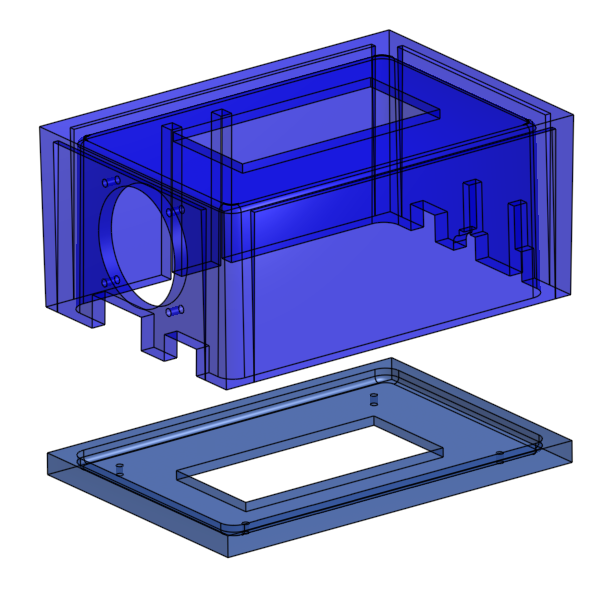

(note: the cut template for the bottom lid may be using a design with more holes meant for the 13.56 MHz version, skip drilling those holes)

## 9. Enclosure Modification

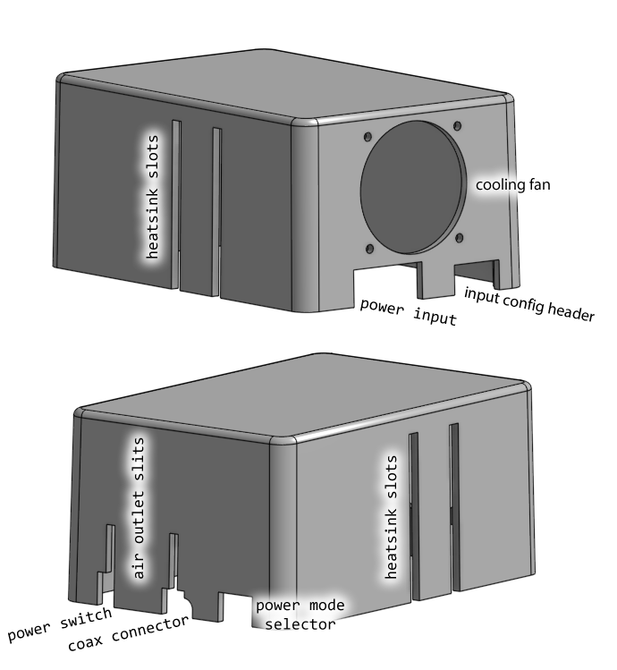

Drill and cut enclosure box and lid. Use the cutting and drilling templates to help. Thread tap enclosure box where needed. Please refer to diagram.

(note: all holes start off with a 2.5mm drill bit, and if needed, a larger drill bit is used after)

(note: the template is designed to be used with a drill press, the surface angles of the template are made so that holes being drilled are perpendicular to the box's tapered walls)

The fan holes are the only holes that need to be larger than 2.5mm, they are supposed to be 3mm or 1/8" diameter holes.

There is an area on the bottom lid where it will touch the SMA coaxial connector. You need to cut (or grind or file) this section slightly. See image

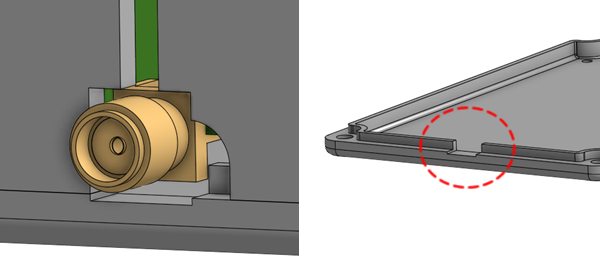

(note: the images here may not reflect the final design, for example, I may have enlarged the air outlet slits)

Perform an inspection of 3D printed parts and make sure they fit on the enclosure, such that the cutouts are the right size and in the right positions. Additional cutting, grinding, and/or filing, maybe required to make adjustments.

Clean all metal shavings, debur all drilled and cut edges, dull all sharp edges.

## 10. Final Assembly and Testing

**Perform a final review of all soldering, including test points, test resistors, solder jumpers.**

Clean the entire PCB, using an antistatic brush and rubbing alcohol.

At this point, you may apply conformal coating over the circuit board if you wish.

Fasten PCB to bottom lid, using the brass standoffs installed previously and M2.5 x 4mm screws.

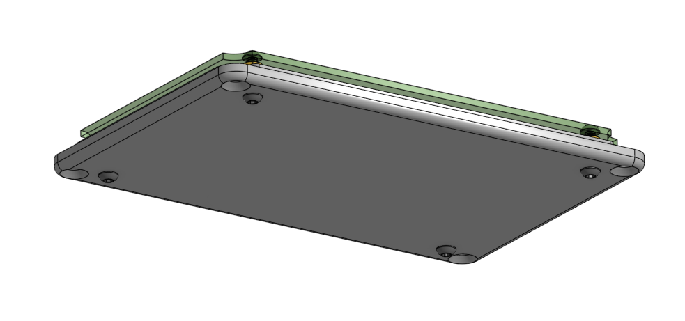

3D print the air intake grille. Assemble cooling fan and the air intake grille to the box. See diagram for details.

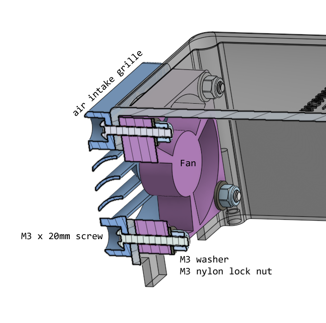

Drop the box over the whole assembly. The heatsink might touch the box, that's ok.

Bend the top two and bottom two heatsink fins outwards against the box wall. This prevents the MOSFET legs from being damaged if the box is dropped.

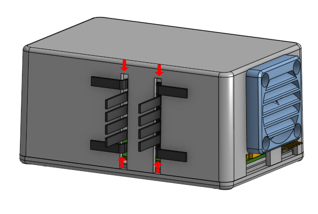

Using the screws that came with the purchase of the enclosure, screw the lid to the box.

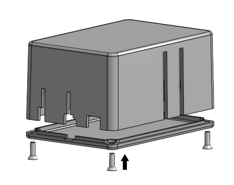

Stick on some rubber feet to the bottom of the enclosure.

<!-- TODO: photograph -->

## Handpiece

#### If using: Radio Thermal Handpiece

Radio Thermal provides instructions on making a cheap handpiece, [please see their instructions](https://github.com/RadioThermal/RadioThermal_Soldering_OSHW/tree/main/Handpiece)

When finished, you can just connect the it to the SMA connector

#### If using: Thermaltronics Handpiece

Thermaltronics still sells their older SHP-K handpieces (meant for 470 kHz cartridges) for about $50 dollars, but they have a weird big connector. You can either cut off the connector and solder on a SMA connector, or make some sort of adapter by yourself.
