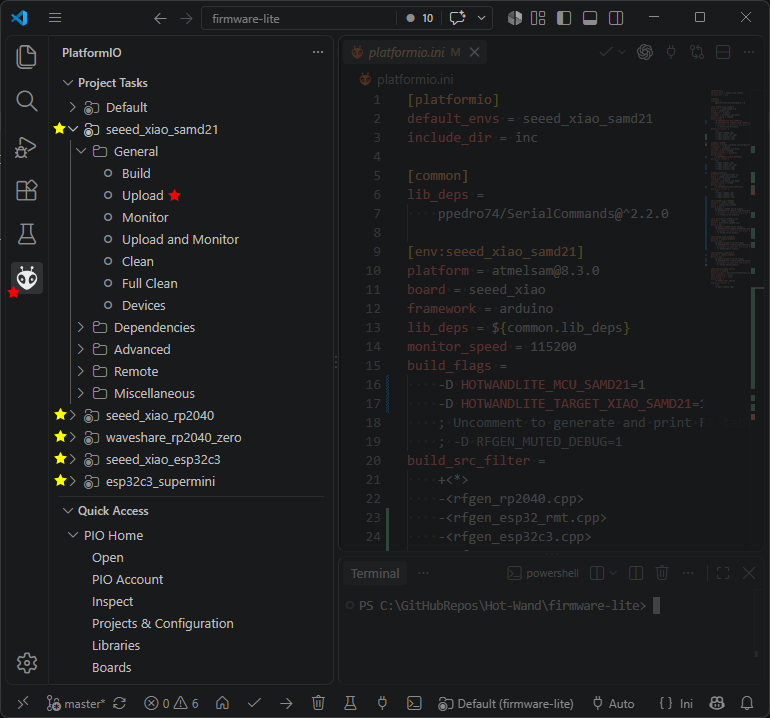

# Firmware Flashing for Hot Wand Lite

While the microcontroller module is removed from the circuit board, plug it into your computer via a USB-C cable.

Run Visual Studio Code **with the PlatformIO extension installed**.

Use Github to obtain a copy of the Hot-Wand project repo. (do this either by cloning it from Github or by downloading the zip package from Github)

Use Visual Studio Code to open the `firmware-lite` directory within the project repo.

PlatformIO will attempt to load the project, this might take a long time. After PlatformIO is ready, it will show the options:

 * seeed_xiao_rp2040
 * seeed_xiao_samd21
 * waveshare_rp2040_zero
 * seeed_xiao_esp32c3
 * esp32c3_supermini

Expand one of these, and click "Upload". It should be that simple.

Note: Visual Studio Code and PlatformIO might need to install more things on your computer when doing this for the first time. It might be super slow.

## Troubleshooting

If something goes wrong, it might be in the build step or in the upload step. If it's in the build step, you can also click "Build" and use the messages to help you troubleshoot.

Problems during the upload step are often caused by driver issues or not selecting the right COM port.
