# Shopping List for Hot Wand Lite (470 kHz version)

This is a practical shopping list for building **one** Hot Wand Lite. It supplements the fabrication files and the JLCPCB-assembled board; it is deliberately not a second BOM. Parts marked `JLC-DNP=2` in the schematic are not listed here because that value only records a temporary JLCPCB stock problem.

Exact manufacturer part numbers matter unless an entry explicitly permits a substitute. Quantities below are the installed quantities for one unit. Distributor stock changes, so a Digi-Key search link is used where a durable exact-product link is unavailable.

## Parts installed on the PCB

### 12 V regulator module

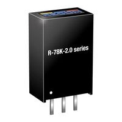

Quantity: **one Recom R-78K12-2.0**. Install it at IC1 to create the 12 V rail used by the power stage and fan. Shop at [Digi-Key](https://www.digikey.com/en/products/detail/recom-power/R-78K12-2-0/18093036).

### Inrush and reverse-polarity MOSFETs

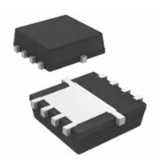

Quantity: **three Vishay SiS862ADN-T1-GE3 MOSFETs**. Install them at Q2, Q3, and Q5 as a part of the power input circuitry. Shop at [Digi-Key](https://www.digikey.com/en/products/detail/vishay-siliconix/SIS862ADN-T1-GE3/10273791).

### Dual input-switch MOSFET

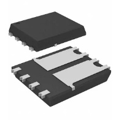

Quantity: **one Diodes Incorporated DMTH64M2LPDWQ-13**. Install it at Q4 in the USB-PD/input switching path. Shop using the exact-part [Digi-Key search](https://www.digikey.com/en/products/result?keywords=DMTH64M2LPDWQ-13).

### Main 470 kHz RF MOSFET

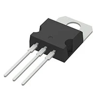

Quantity: **one**, installed at Q1 as the main RF power switch. Radio Thermal used `IRF640NPBF`. Shop at [Digi-Key](https://www.digikey.com/en/products/detail/infineon-technologies/IRF640NPBF/811884).

Alternative: [IXFP30N25X3](https://www.digikey.com/en/products/detail/ixys/IXFP30N25X3/7561333), it's expensive.

### USB-C connector

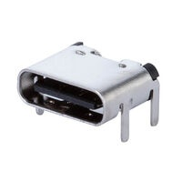

Quantity: **one Same Sky UJC-H-G-SMT-P6-TR**. Install it at JP2 for USB-PD input power. The drilled shell stakes and six-pad charge-only footprint must match the PCB. Shop at [Digi-Key](https://www.digikey.com/en/products/detail/same-sky-formerly-cui-devices/UJC-H-G-SMT-P6-TR/24818614).

### XT30 board connector

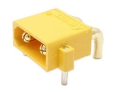

Quantity: **one XT30PW-M**. Install it at JP3 as the high-current DC input. It is the right-angle male PCB version. Search for this on your preferred online shop.

### USB-PD selection header

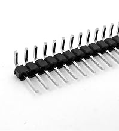

Quantity: **one six-pin segment cut from a 1-by-40, 2.54 mm right-angle male breakaway header**. Install the six-pin segment at JP5 so the input voltage and current request can be selected. A long strip is inexpensive and leaves enough spare header for JP6, JP4, and other projects. Search for [2.54 mm right-angle breakaway headers on Amazon](https://www.amazon.com/s?k=2.54mm+right+angle+male+breakaway+header+1x40).

### USB-PD selection shunts

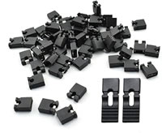

Quantity: **two installed; buy one bulk bag of generic 2.54 mm jumper shunts**. Fit two shunts to JP5 to make the independent USB-PD selections. Prefer the taller style with a pull tab or handle because it is much easier to move in the completed unit. Search for [bulk 2.54 mm pull-tab jumper caps on Amazon](https://www.amazon.com/s?k=2.54mm+jumper+caps+with+handle+pull+tab).

### 470 uF bulk capacitors

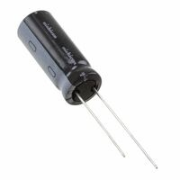

Quantity: **two Nichicon UHW1H471MPD, 470 uF, 50 V capacitors**. Install them at C12 and C13. Their 10 mm diameter and 5 mm lead spacing fit the intended footprints. Shop at [Digi-Key](https://www.digikey.com/en/products/detail/nichicon/UHW1H471MPD/3664388).

### Fuse clips

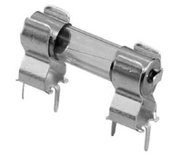

Quantity: **two Keystone 3518P clips**. Together they form the F1 holder for one 5-by-20 mm glass fuse. Shop at [Digi-Key](https://www.digikey.com/en/products/detail/keystone-electronics/3518P/316011).

### Input fuse

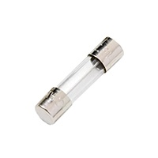

Quantity: **one Littelfuse 0235007.MXP, 7 A, 5-by-20 mm fast-acting glass fuse**. Install it in F1 to protect the input wiring and board during a fault; buying spares is sensible, but one is installed per unit. Shop at [Digi-Key](https://www.digikey.com/en/products/detail/littelfuse-inc/0235007-MXP/3424905).

### SMA handpiece connector

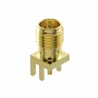

Quantity: **one SMA-J-P-H-ST-EM1 edge-launch jack**. Install it at JP1, in the orientation shown by the build guide, as the 470 kHz handpiece output. Its launch geometry must match the board footprint. Shop using the exact-part [Digi-Key search](https://www.digikey.com/en/products/result?keywords=SMA-J-P-H-ST-EM1).

### Slide switch

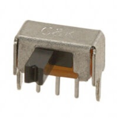

Quantity: **one Same Sky SLW-864574-5A-RA-N-D**. Install it at SW1 as the Lite unit's external control switch; the right-angle actuator and footprint are mechanically specific. Shop at [Digi-Key](https://www.digikey.com/en/products/detail/same-sky-formerly-cui-devices/SLW-864574-5A-RA-N-D/24399231).

### XIAO controller module

Quantity: **one Seeed Studio XIAO with pre-soldered headers**, as the microcontroller module. See assembly instructions to see which exact modules are compatible.

### XIAO socket headers

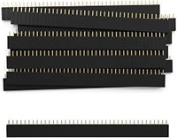

Quantity: **two seven-pin segments cut from a long 2.54 mm female breakaway socket strip**. Install them at U1 so the XIAO can be removed or replaced without desoldering the module. Buy a long strip and cut it to size rather than ordering two individual sockets; search for [2.54 mm female breakaway headers on Amazon](https://www.amazon.com/s?k=2.54mm+female+breakaway+header+1x40).

### Four-pin fan header

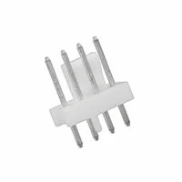

Quantity: **one Molex 0470531000**. Install it at FAN1 for the 12 V PWM fan. It is the keyed four-position PC-fan header expected by the fan cable. Shop at [Digi-Key](https://www.digikey.com/en/products/detail/molex/0470531000/2421261).

### Output-selection header

Quantity: **one four-pin segment cut from the same 1-by-40, 2.54 mm right-angle male header used for JP5**. Install it at JP6 only if the selectable output-level interface will be used; it exposes the signal-name selections documented in the build guide. Search for [2.54 mm right-angle breakaway headers on Amazon](https://www.amazon.com/s?k=2.54mm+right+angle+male+breakaway+header+1x40).

### Output-selection shunts

Quantity: **two additional 2.54 mm pull-tab jumper shunts**. Fit them across the two signal-to-ground pairs at JP6 when the output-level selection header is installed. They can come from the same bulk bag purchased for JP5; search for [bulk 2.54 mm pull-tab jumper caps on Amazon](https://www.amazon.com/s?k=2.54mm+jumper+caps+with+handle+pull+tab).

## Custom inductors

### Kool Mu cores

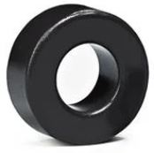

Quantity: **five Magnetics 0077932A7 Kool Mu cores**. Use two stacked cores for L2 and one core each for L3, L4, and L5. The material, dimensions, and nominal 32 nH/turn² factor determine the winding instructions. Shop at [Digi-Key](https://www.digikey.com/en/products/detail/magnetics-a-division-of-spang-co/0077932A7/18626819).

### 22 AWG magnet wire

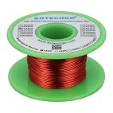

Quantity: **at least 5 m (16.4 ft) of solid 22 AWG enamelled copper magnet wire**. It winds L2 through L5 and leaves useful margin for trimming, measurement corrections, or one rewind. A small hobby spool is much more economical than distributor-cut wire; search for [22 AWG enamelled copper magnet wire on Amazon](https://www.amazon.com/s?k=22+AWG+enameled+copper+magnet+wire). Make sure it is solid copper, not copper-clad aluminum.

### Core-stacking epoxy

Quantity: **one small package of rigid two-part epoxy**. Use a small amount to join the two 0077932A7 cores used by L2 before winding them; the joint must be thin enough that the winding-length guidance remains useful. An inexpensive consumer epoxy is sufficient; search [Amazon](https://www.amazon.com/s?k=two+part+epoxy+small+package), or buy it from a local hardware store.

## Cooling and enclosure hardware

### Aluminum enclosure

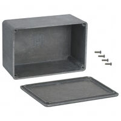

Quantity: **one unpainted Hammond 1590T enclosure**. It is the chassis, shield, and mechanical protection for the finished unit; the project drilling templates are made for this box. Shop at [Digi-Key](https://www.digikey.com/en/products/detail/hammond-manufacturing/1590T/131037).

### MOSFET heatsinks

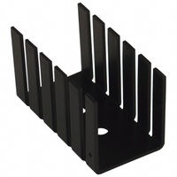

Quantity: **two Boyd 504222B00000G heatsinks**. Stack them around Q1 as shown in the Lite build guide to cool the main RF switch and brace it against the enclosure wall. Shop at [Digi-Key](https://www.digikey.com/en/products/detail/boyd-laconia-llc/504222B00000G/5833).

### Cooling fan

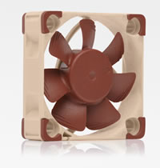

Quantity: **one Noctua NF-A4x10 PWM, 12 V, 40-by-40-by-10 mm fan**. Shop from [Noctua's product page](https://www.noctua.at/en/products/nf-a4x10-pwm).

This can be substituted with any inexpensive 40 mm x 40 mm x 10 mm, 12 V, four-wire PWM cooling fan with the standard PC-fan connector and pinout.

### TO-220/TO-247 thermal pad

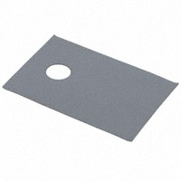

Quantity: **one electrically insulating silicone transistor pad sized to cover the final Q1 package**. Place it between Q1 and the heatsink; it is mandatory because the transistor's drain tab must remain electrically isolated from the mounting hardware. T-Global DC0011/06-TI900-0.12-2A is suitable if Q1 is TO-220; if the selected Q1 is TO-247, buy a larger pad or an insulating sheet that can be cut to size. Shop for the TO-220 pad at [Digi-Key](https://www.digikey.com/en/products/detail/t-global-technology/DC0011-06-TI900-0-12-2A/3466708).

### Transistor shoulder washer

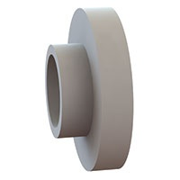

Quantity: **one nylon shoulder washer for a #4 screw, approximately 3.7 mm outside diameter and 2 mm shoulder depth**. Fit it into Q1's tab hole to isolate the screw from the drain tab. Confirm it fits the final Q1 package. Shop for 12SWS0432 using the [Digi-Key search](https://www.digikey.com/en/products/result?keywords=12SWS0432).

### Q1 mounting screw

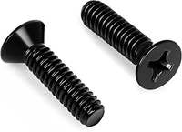

Quantity: **one #4-40-by-1/2-inch countersink screw**. It passes through the shoulder washer, Q1, thermal pad, and heatsink stack shown in the build guide. Buy a small pack from [Amazon](https://www.amazon.com/s?k=%234-40+x+1%2F2+countersink+screws), or use a local hardware store.

### Q1 mounting locknut

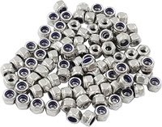

Quantity: **one #4-40 nylon-insert locknut**. It clamps the Q1 heatsink stack without loosening in service. Buy a small pack from [Amazon](https://www.amazon.com/s?k=%234-40+nylon+insert+locknuts), or use a local hardware store.

### Brass PCB standoffs

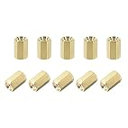

Quantity: **four female-female M2.5 standoffs, 6 mm long with a 4.5 mm hex body, made of brass**. They space and support the PCB above the enclosure lid at the four mounting holes. Search for [M2.5-by-6 mm brass female-female standoffs on Amazon](https://www.amazon.com/s?k=M2.5+6mm+female+female+brass+standoff), checking the product drawing for the required body dimensions.

### M2.5 PCB screws

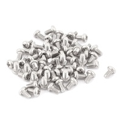

Quantity: **eight M2.5-by-4 mm screws**. Use four to attach the standoffs to the PCB and four to attach the standoffs to the enclosure lid. Buy a small pack or metric electronics-hardware assortment from [Amazon](https://www.amazon.com/s?k=M2.5+x+4mm+screws).

### Fan screws

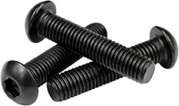

Quantity: **two M3-by-20 mm screws**. They pass through the fan and its printed mounting feature.

This can be substituted liberally as long as you also substitute the nuts and washers these will screw into.

### Fan washers

Quantity: **four M3 flat washers**. They spread the fan-fastener load on the fan.

This can be substituted liberally as long as they fit the screws being used with it.

### Fan locknuts

Quantity: **four M3 nylon-insert locknuts**. They keep the fan fasteners from loosening under vibration.

This can be substituted liberally as long as they fit the screws being used with it.

### Rubber feet

Quantity: **four self-adhesive rubber bumper feet**. Put them on the enclosure lid so the finished unit does not slide or rest directly on its screw heads. Buy a generic sheet or bulk pack of [small adhesive rubber feet from Amazon](https://www.amazon.com/s?k=small+self+adhesive+rubber+bumper+feet).

### Thermal paste

Quantity: **one small tube of ordinary non-electrically-conductive CPU thermal paste**. Apply it only at the metal-to-metal heatsink interfaces shown in the build guide; it is not a substitute for the electrically insulating pad at Q1. Any inexpensive generic paste is adequate. Search [Amazon](https://www.amazon.com/s?k=non+conductive+CPU+thermal+paste), and do not use liquid metal.

### 3D-printer filament

Quantity: **enough PETG for the final plastic parts and enough PLA for the disposable templates, if printing them yourself**. Use PETG for the intake grille and anything else that remains near the hot enclosure. PLA is adequate for drilling and cutting templates that are discarded after use. One standard spool of each is far more than a single unit consumes, so use filament already on hand or ask someone to print the parts.

## Handpiece and tip

### Commercial 470 kHz handpiece

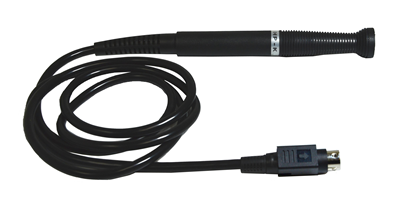

If using the commercial path instead of the Radio Thermal handpiece. It holds Thermaltronics K-series cartridges; its original connector must be adapted or replaced to mate with the Hot Wand Lite's SMA output. Shop at [Digi-Key](https://www.digikey.com/en/products/detail/thermaltronics/SHP-KM/22491869).

#### Mating SMA cable plug

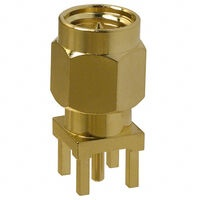

**Amphenol RF 901-9895-RFX**. This is a straight, in-line, standard-polarity SMA plug with a male center pin, so it mates with the female SMA jack at JP1. Shop at [Digi-Key](https://www.digikey.com/en/products/detail/amphenol-rf/901-9895-RFX/272187).

### K-series soldering cartridge

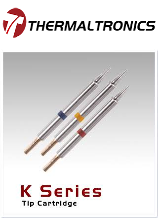

If using the SHP-KM path. Select the geometry and temperature that suit the work; K75C002 is one example, not a universal choice. Browse the [Thermaltronics K-series catalog](https://www.thermaltronics.com/k_series.php).
