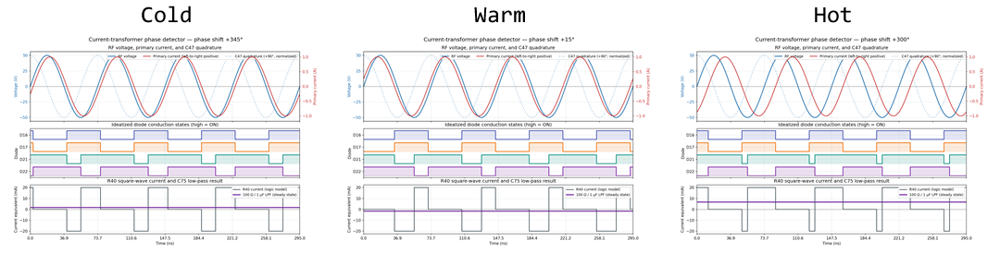
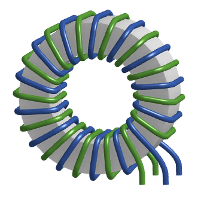
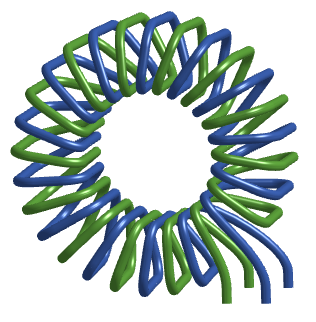

In SergeyMax’s design, there is a current transformer at the RF output. It is using one of the same toroid cores that’s used in other places in this design. The primary winding is just a single loop of the RF output. The transformer is 1:14:14 so the two secondaries are both 14, and it’s kind of like 28 but with a center tap. The tap is connected to the RF output through a 10pF capacitor. The output of the transformer goes to something that resembles a full bridge diode rectifier. That goes to what looks like a RC filter before a resistor leading to the feedback network of the main buck converter.

At a simple first glance, I assumed that this was some sort of stability or protection mechanism. More current would mean more signal driven into the feedback network and thus lower the buck converter’s output voltage. I thought maybe this was to compensate for some sort of voltage drop caused by in-rush, maybe the buck converter overcompensated for voltage drops like that, and needed something to stabilize it.

SergeyMax’s own blog post didn’t really give a clear answer, and other people building his design were also studying it. This forum thread is a goldmine https://www.eevblog.com/forum/projects/i-built-the-diy-metcal-compatible-soldering-station/

TLDR: This is a power factor meter. As the temperature of the iron tip changes, the complex load changes, shifting the phase relationship between RF voltage and current. The tip doesn't need or want more power when it is already hot, and the power factor will change. This current transformer circuit is able to sense this by detecting the phase difference between voltage and current, and then it tells the buck converter to lower its output voltage when the tip doesn't want more power. (technically it also tells the buck converter to raise the voltage when it is cold)

The builder posted to the forum thread:

> At first I thought it was a simple current sense circuit, but then I noticed that the RC filter is a lowpass at around 2 kHz, and the diodes are not arranged in a rectifier configuration.
> 
> After poking at it a bit with some friends, we realized this is actually a **ring mixer** that mixes the output current with the output voltage to measure the phase angle between voltage and current! Which makes a ton of sense actually: We want to reduce the output power as the iron tip reaches the curie point. As it does so, the inductance of the iron tip will drop, causing the phase angle between voltage and current to move away from 45 degrees.
> 
> In other words, it's effectively a power factor meter!

later

> Here's how it works:
> 
> Current flows in the same direction on the schematic on primary and secondary side (same polarity voltage = opposite polarity current!)
> 
> The node between D16 and D17 is clamped to approximately +/-2V by the diode ring.
> 
> Because of the above, we can think of C47 as being from the output voltage to essentially ground, as the voltage on the other side of C47 is much greater than 2V in magnitude. Therefore, the current through C47 is approximately the same as it would be were it connected to ground--in quadrature with the output voltage and equal to approx Vout / 1173 ohm (either RMS or peak since it's a sinusoid)
> 
> When primary current is flowing left to right--i.e. towards the soldering iron tip--D16 and D17 are reverse-biased, and therefore no current flows through R40
> 
> When primary current is flowing right to left, the current induced in the secondary flows through D16 and D17, and the additional current injected by C47 has nowhere to go but into R40--until the voltage at that node gets high enough that either D21 or D22 is forward biased. Because the current injected by C47 is so high, this results in R40 effectively seeing a square wave current which you can see in the LTSpice simulation above.
> 
> So if we want to create a simplified model of how R40 is being driven, we can think of it like this:
> 
> - Not driven when primary current is flowing left to right
> - Driven at +2V when primary current is flowing right to left and current is flowing down through C47
> - Driven at -2V when primary current is flowing right to left and current is flowing up through C47
> 
> Because the current through C47 is 90 degrees out of phase with the output voltage we can then reach the conclusion that
> 
> **if the output current and voltage are in-phase, periods 2 and 3 are of equal time and thus the voltage at C1 is zero**
> 
> . Of course, that voltage is also being pulled towards 0.8V via its connection to the feedback loop of the DC-DC, but we'll ignore that for now.
> 
> If the output voltage starts to lead the output current, then period 2 will lengthen and period 3 will shorten, and the voltage on C47 will be pulled higher. Likewise if the current leads the voltage, the inverse will happen and the voltage on C47 will be pulled lower.
> 
> So in essence this is not as dependent on the magnitude of output current and voltage, and much more on the relative phase, which makes sense.
> 

I have represented this with an animation

If you wish to see the individual frames, [click here for all the frame files](imgs/current_transformer_plots/)

For the three examples of tip temperature states and their resulting waveform:

The numbers used in this model are in this document at the bottom.

## My Own Implementation

The builder told me that he didn't get the current transformer to work with any of the substitute toroid cores, it only started working once he put in the effort to import some of the Russian ones that SergeyMax used.

The rule of thumb is that for a transformer application, a different AL doesn't mean I have to change the winding ratios, it's a ratio after all.

The toroid core I picked is a Fair-Rite 5961004901. The material is "61", the AL is supposedly higher than the one SergeyMax used, and the datasheet claims that it is a "high frequency NiZn ferrite material developed for a range of inductive applications up to 25 MHz".

On paper, this current transformer is behaving almost like a digital component because of the way the diodes clamp the voltage. The current transformer and the 10pF capacitor really just need to provide enough signal strength to actually cause the diodes to conduct. So this means the Fair-Rite substitute should work better, in a sense. But the concern is that the different material causes a phase delay from primary to secondary, which would obviously ruin the whole thing as the whole point is to measure the phase difference between voltage and current.

I planned out the winding in 3D with consideration for my transformer PCB footprint. All wires are to be 22 AWG (SergeyMax used 0.6mm). There isn't many photos of this component so I thought a 3D model would help a ton.

It's possible and even beneficial to make this winding in a bifilar fashion. (it is a pain to 3D model in such a way)

Also, it's hard to get the directions wrong, because the directions for the current flow (the primary current must be in the opposite direction of the secondaries) are actually dictated by the PCB design, not the winding direction. You can wind it clockwise or counterclockwise and it is theoretically going to do the same thing physically. But, do not criss-cross at the bottom!

## Iron Tip Model

For simulations, it is useful to know how to model the iron tip as if it was a complex load.

I got these measurements from http://randomfunprojects.co.uk/metcal.html

Measurements at 13.56 MHz of a STTC-147 tip

| Tip state | Resistance, R (Ω) | Reactance, X (Ω) | Equiv. component | SWR  | S11  |
| --------- | ----------------: | ---------------: | ---------------: | ---: | ---: |
| Cold                                | 42.3 | +j13 |     153 nH      | 1.4 |  -16 dB |
| Warm (below Curie temperature) | 55   | -j16 |     730 pF      | 1.1 |  -23 dB |
| Hot (above Curie temperature)  | 12   | +j24 |     280 nH      | 5.1 | -3.4 dB |
