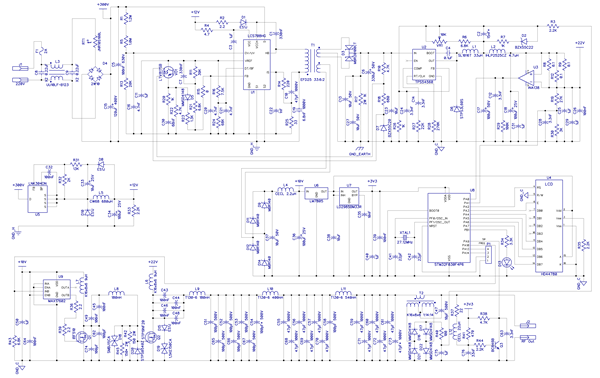
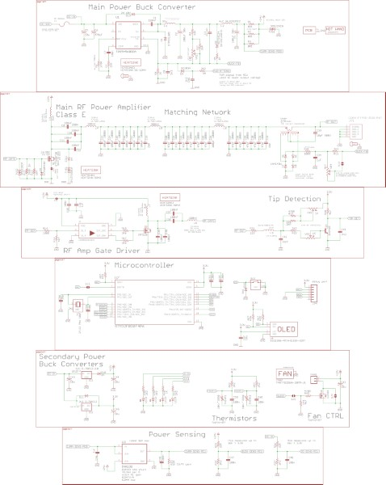
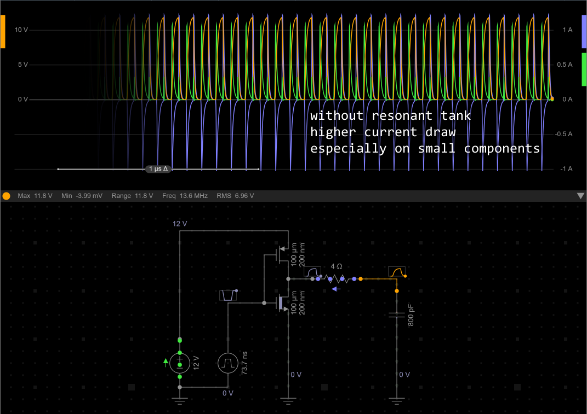
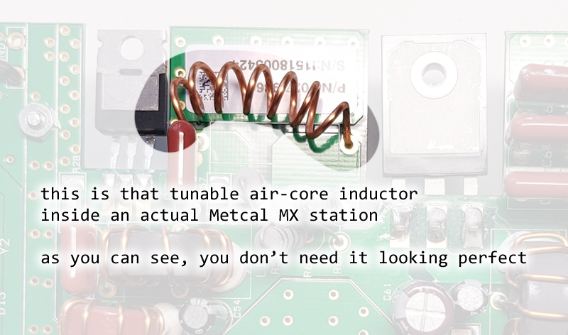
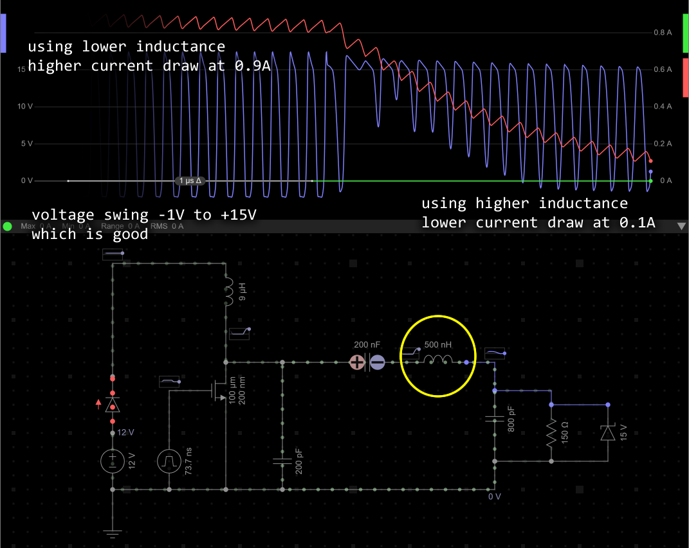
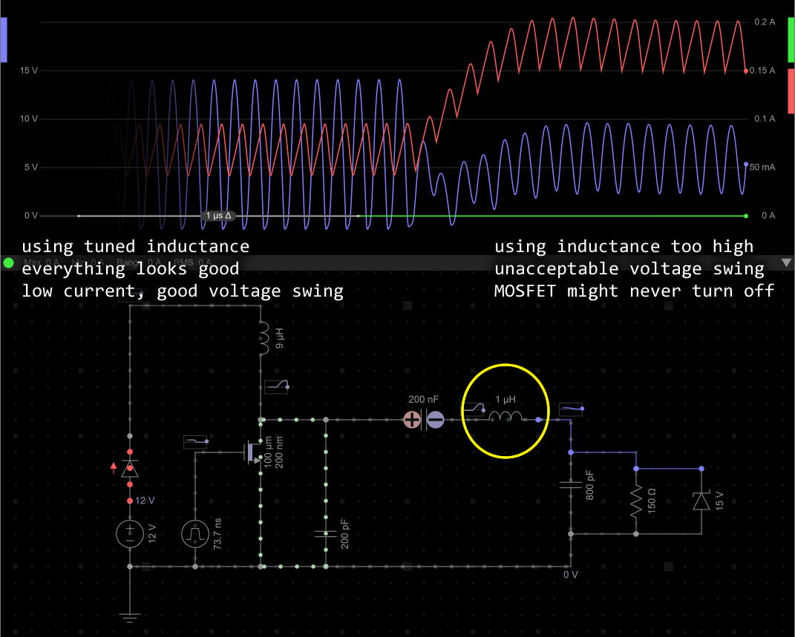

Designing Hot-Wand was the result of me being inspired by these projects, and then studying them

[SergeyMax's GitHub](https://github.com/SergeyMax/SolderingStation), and SergeyMax's [blog post](https://habr.com/en/articles/451246/) (note: this is a translated version from Russian)

[Radio Thermal's GitHub](https://github.com/RadioThermal/RadioThermal_Soldering_OSHW) and Radio Thermal's [website](https://radiothermal.com/)

At the heart of both is a RF class E amplifier, followed by an impedance matching circuit. Drive the amplifier at the specified frequency and it will output RF power to the iron cartridge.

The Radio Thermal design uses a ATtiny microcontroller to generate the 470 kHz square wave that drives the gate of the MOSFET in the amplifier. There's no power preconditioning or any feedback, nothing fancy, it is extremely simple.

SergeyMax's efforts stemmed from tearing down an actual Metcal soldering station, reverse engineering it, and then building a cheap compact replica. It is way more complicated.

(for personal reasons, I wanted to build a 13.56 MHz version, hence why the extra effort, these reasons may not be totally right in hindsight but that's what I did lol)

In SergeyMax's design, there are the major sections:

 * AC power input, which provides the DC input to the main buck converter and also has a tapped 10V-ish for the gate driver
 * main buck converter, set to about 20V but adjustable, with high side current measurement
 * gate driver for the second gate driver, weird...
 * a second gate driver stage, this is important
 * the class E RF amplifier
 * the impedance matching network
 * a current amplifier right before the RF output
 * a tip detector that detects high voltages at the RF output and signals the microcontroller
 * linear regulators for the microcontroller
 * microcontroller and LCD screen

SergeyMax's schematic is a bit hard to decode as it is drawn to fit everything onto one sheet of paper and also does not use net flags. Drawing it out again into logical blocks help.

### Input Power

I can blow away the AC power input section and replace it with a DC power input quite easily (most other builders of his design also removed his AC power input, because it's designed for Russia's 220V AC). I don't want to play with wall AC power and would rather delegate that to off-the-shelf USB-PD chargers and power banks.

The Radio Thermal design does not use a buck converter so the RF power input is the unconditioned DC power input. SergeyMax's design uses a buck converter, his design is wall powered so it's gotta have something to take AC power from a transformer and turn it into steady DC. You can't just rectify it and pray. The output from a transformer, even if rectified, is unregulated, with substantial ripple and a voltage that varies with load because of the transformer's finite source impedance.

The buck converter in SergeyMax's design implements a feedback network with an adjustable pot and also has a feedback from the current transformer. The adjustment pot sets the "typical" output voltage of the buck converter, while the microcontroller and the current transformer are able to influence the output voltage further.

For my own design, I really wanted to have adjustable power levels. The best way to accomplish this is to have a microcontroller interface with the feedback signal of the buck converter. So I kept it in my design (I was debating whether I can simplify it away).

The feedback from the current transformer is kind of a power saving feature for added efficiency. It is a power factor detector that tells the buck converter to chill out if the iron tip is already hot. I have a [page written about it here](design-study-current-transformer.md).

You might have noticed that the buck converter circuit has a second LC stage before the current sensor and RF amplifier. This is simply a filter stage to isolate the buck converter's domain from the RF domain, the first is switching at 450 kHz and the latter is switching at 13.56 Mhz and SergeyMax picked 450 kHz and added the filter stage so these two domains don't interact or beat with each other.

Important: another builder pointed out that the 6.8kohm resistor on the buck converter feedback network is the wrong value, and will only allow for about 14V maximum output. He swapped it for a 22kohm and so did I. The original design had a 22V zener beside this resistor in the feedback network that would've capped the voltage at 22V, I upped this zener to 24V as well. My design might be considered a bit "overclocked", but you don't have to actually tune it that high. Later in this document I discuss more protection mechanisms placed around this buck converter. (in other good news, 24V zeners and TVS diodes are wayyy more common anyways, a win for DFM)

### Gate Driver

SergeyMax's design has two big MOSFETs instead of just one. One of them is the main RF class E amplifier's MOSFET, the other one is part of another smaller RF class E amplifier that drives the gate of the bigger one. The difference is that, we are now playing at 13.56 Mhz not 470 kHz. Driving a MOSFET gate at this high frequency means the charges at the MOSFET gate are moving back and forth through the gate driver much frequently. At 470 kHz, moving these charges from the positive supply into the gate, and then out of the gate into ground, at 4A, is not problematic.

The dilemma is that, the RF amplifier needs a big beefy MOSFET that can survive high currents and high voltages (the reverse engineered unit had a MOSFET rated for 500V), but big silicon means big gates, which means big gate capacitance.

This simulation below is representing an ordinary push-pull driver at 12V, driving into a 800 pF capacitor pretending to be a MOSFET gate:

At 13.56 MHz, this becomes upwards of 4W of heat being wasted, by very small parts.

The solution is to use a first stage with a MOSFET chosen to have a very very small gate capacitance, and it can be small because this amplifier only needs to generate about 12V with almost no real current. This MOSFET, along with the inductors and capacitors around it, form another smaller class E amplifier with a resonant tank. This resonant tank is resonanting at 13.56 MHz, bouncing the charges in and out of the gate of the much bigger MOSFET. The charges are being recycled, instead of going in a DC circuit from positive to negative.

[Click here for a more in-depth study of the power consumption comparisons](gate-driver-method-comparison.md)

There is an inductor in the design to tune the resonance of this circuit. The instructions from SergeyMax basically says: make a coreless coil with wire, 10 loops of wire about 5mm in diameter and 10mm wide, you need to stretch or compress this until you tune the resonance correctly.

| Coil Width | Napkin Math Inductance |
|-----------:|:-----------------------|
| 5 mm       | 375 nH                 |
| 10 mm      | 224 nH                 |
| 15 mm      | 160 nH                 |

You might want to start off with 15 mm wide and then compress it until it is tuned, because it is harder to stretch it when it is on a PCB.

I plugged this into a simulator and was able to play with the inductance until the current consumption dropped to 100mA at 12V. 1.2W vs 4W, and moving the heat away from the small parts. Not bad.

If you go overboard with stretching the coil then you end up with an output waveform either not low enough or not high enough. The wave form must at least reach 0V or else the next MOSFET won't actually ever turn off, which would essentially cause a short circuit event.

The MOSFET STP19NF20 datasheet says it has a C_iss of 800 pF. The calculation for this L becomes `L = 1 / ((2 * pi * 13.56e6) ^ 2 * 800e-12)` which is `= 172 nH`. The schematic rounded this as 180 nH. The reactance from L8 nearly cancels out the reactance of the Q1 gate

`X(L8)       = 2 * pi * 13.56e6 * 180e-9         = 15.34 ohms`

`X(Q1 gate)  = 1 / (2 * pi * 13.56e6 * 800e-12)  = 14.67 ohms`

If we choose a different MOSFET wit ha different C_iss, then the tuning will change.

### Impedance Matching Networks

Analysis on how the impedance matching networks work are written in these two pages:

 * [For the Hot-Wand 13.56 MHz](impedance-matching-13.56MHz.md)
 * [For the Hot-Wand-Lite 470 kHz](impedance-matching-470kHz.md)

### Protections

SergeyMax's design has a ton of TVS diodes and Zener diodes protecting these MOSFETs. He did explicitly say that the Metcal unit used a 500V rated MOSFET, but keeping in mind his blog post is from 2019, he found that MOSFET to be too expensive and found a smaller one rated 200V, and just added more 150V TVS diodes. I looked up that bigger MOSFET today... $20 each, so I feel him.

But why did the Metcal use a 500V rated MOSFET and SergeyMax decide that 150V is enough? The circuit isn't actually supposed to let that V_DS voltage get that high in normal operation, when a proper RF soldering iron cartidge is installed, the output impedance is matched and there is a place for all the energy to go. When you unplug the iron cartridge, the output is open circuit and there's nowhere for the energy, stored as magnetic fields in the inductors, to go. The inductors will spike the voltage to hundreds of volts.

Even if you had a detector for disconnection of the cartridge, your MOSFET must survive this spike somehow, either by being rated very high, or having a TVS diode buddy taking it. It does not matter how fast your tip detection circuit works, the energy is already stored, if it has no where to go, even shutting down the RF generator does stop the voltage spike from happening.

### Tip Detector

There is a NPN transistor and some surrounding circuitry that is triggered by the disconnection of the iron cartridge, and signals to the microcontroller. The microcontroller's job is to stop the generation of the RF wave signal if the tip is detected to be disconnected. SergeyMax's firmware will retry to see if the tip reconnected automatically after a few seconds, which is similar to what actual Metcal stations do. My firmware does not and requires the user to press the button to confirm the tip swap has been completed.

The way it works is that a tiny DC current is constantly fed into the iron tip, diverting it to ground. If the tip is not there, that current builds up a charge in a capacitor and then goes through the transistor base instead. [A full study on how this works is available by clicking here](tip-detector.md)

### Microcontroller

The last bit I needed to study is how the microcontroller is generating the 13.56 MHz signal. SergeyMax used a STM32F030F4P6 and a 27.12 MHz crystal in the circuit. The STM32 uses its timer to generate a PWM signal with period of 2 system clock ticks, resulting in a 13.56 MHz square wave.

While SergeyMax used a classic HD44780 chipset 16x2 LCD screen, I wanted to use a SSD1306 chipset OLED screen, which means using I2C. SergeyMax used one of the I2C pins for the PWM generation so I had to reassign the PWM generation pin to another timer channel, not a huge deal. Writing out the code a bit while integrating the U8g2 graphics library into it, it seemed likely that my code will exceed 16kb, so I made sure my circuit is compatible with both the STM32F030F4P6 and the STM32F042F6P6, which has the same footprint but 32kb of flash memory.

Fun fact... more modern STM32 families, like STM32C or STM32G, don't offer the same pin-out or crystal inputs for their smaller packages. But luckily, while exceeding 16kb, the firmware is still under 32kb, so I don't need to upgrade beyond a STM32F042.

With all the pins assigned, I still had two ADC capable pins left, so I added footprints to connect two NTC thermistors, just in case I want to monitor temperatures in the circuit somewhere. The buck converter is going to get hot but it's got an internal thermal cutoff, the two MOSFETs do not have anything monitoring them, so these are the primary suspects.

### DC Power Input

The power input in my design is my own design, it is not derived from either of the preceding projects.

For battery power, I put in a XT-30 connector in my design, as the choice is between XT-30 and XT60, and I simply will more likely need it to be XT-30. My own small combat robots all use XT-30 and our team's bigger robots use other much bigger connectors.

For USB-C power input, it uses a USB-PD negotiation IC [AP53781](https://www.diodes.com/part/view/AP53781), compatible with PD3.2, to obtain 28V (from EPR, Extended Power Range). This IC is quite simple, you pick the voltage and current using two resistors. You can also pick "automatic" for the current. The hope is that, if 28V is unavailable from the connected charger, then it will fall back to the next lower voltage, which is 20V.

I chose to use a USB-C charge-only connector to simplify the layout, which means there are no data signals. This means the connector is incompatible with Qualcomm QuickCharge. AP53781 can only negotiate QC up to version 3.0 which is capped at 36W, way too low anyways. So it's not a big deal to not have USB data signals.

With two power inputs, I need one to not explode the other, especially the battery. That's why I added an ideal-diode controller to the circuit. If the USB power is detected, the ideal-diode controller is simply shut down via its enable pin. This prevents 28V from USB from making a 20V lithium battery explode if somebody plugs in both. And vice versa, a battery is also not able to damage a USB charger because the ideal-diode controller would be shut down.

I am not using a 10V tap from a AC transformer like SergeyMax, instead, I've placed a 12V fixed voltage buck converter in the circuit. This powers the gate driver and the cooling fan. The microcontroller is also powered by a similar 3.3V buck converter. These are small and compatible with 78XX series voltage regulators.

Leaving out a barrel jack in my design is a deliberate decision.

I also added a classic glass fuse in my design. I expect it to be appreciated during a short circuit event or a MOSFET failure.

There is some inrush current to worry about. This is discussed later.

### Thermal and Cooling

SergeyMax talked about how the buck converter needed ground via stitching under the IC's exposed bottom pad, plus the vendor uses 2oz copper. SergeyMax's own layout does have the ground stitching, and he even put in a lot of effort making sure the ground plane isn't partitioned near the buck converter.

In my own design, I follow the same practices, and in addition, I put a heatsink and standoff in the area near the buck converter IC. The standoff is made of brass and will conduct some heat from that area of copper to the aluminum enclosure.

SergeyMax's photos shows he's put small generic heatsinks onto the backs of the MOSFETs. I have also put heatsinks on my MOSFETs, and the heatsinks are pressed against the aluminum enclosure for extra effectiveness. I do have to bend and cut my heatsinks so they fit in the design though, a bit inconvenient.

The Radio Thermal design uses a decently sized cooling fan, but when I talked with the authors in person during their demo, they said it will run without the fan. However, without cooling, the magnetic properties of the inductor toroids will change and the whole circuit will go out of tune slightly, causing it to be more inefficient.

In my own design, I had plenty of PCB space and physical space to spare, so I added a small 20mm fan. It is controlled by a MOSFET driven by the microcontroller. The user can choose to leave the fan off, or always on, or use temperature sensors to determine when the fan should run.

### Hand Wound Inductor Considerations

First, if you were reading SergeyMax's post and confused as to where he put instructions for winding the custom inductors, the actual instructions are inside the schematic file, you must open it with DipTrace first, you can get a free view-only version to do so.

The instructions for the K16x8x6 9uH inductors (2 of them) are to use 22 AWG wire with 15 turns. The toroid core SergeyMax actually used only existed in Russia. The closest match I found on Digi-Key is Fair-Rite 5961004901, but the target is now around 10 or 11 turns instead of 15.

Other builders of the design have stated that landing on something 10uH is totally fine and might even work better. One community member experienced an overheating core and suspects it was because it was made of iron powder instead of ferrite.

For the current transformer that's supposed to use the same toroid core, no change is needed. Although, I did add an adjustment potentiometer just in case I need to tune the output of the feedback signal from this current transformer.

For the three large inductors, I purchased the same toroid cores T130-6 from Amidon as SergeyMax specified. The instructions are to use 16 AWG wire, and the turns are 4, 6, and 7. There's no point in attempting to wind these differently, as each turn results in such a huge difference in inductance, that you should just follow the instructions and hope for the best.

In Radio Thermal's design, they used the Kool Mu 0077932A7 core, with Aₗ = 32 nH/turn², +/- 8%. The first core is actually two of these cores epoxied together in a stack, making it roughly Aₗ = 64 nH/turn².

For 6.2 uH: 10 turns if using 2 cores, 14 turns if using 1 core

For 16.9 uH: 22 to 24 turns (choose 23 if no measurement)

For 11.5 uH: 18 to 20 turns (choose 19 if no measurement)

They ask that you use 22 AWG wire or thicker, and use a VNA or LCR meter to verify the results.

### Additional Protections

There are online discussions about SergeyMax's design, some other people have tried to build it and ran into problems.

One person reported that the 22 ohm resistor (it's a 0805 footprint in SergeyMax's layout) "failed enthusiastically" when the tip was disconnected while the circuit was running. So in my design, I put a 2W rated resistor (2512 footprint) in it's position.

Note that a lot of builders did what I did, replace the AC converter circuit with a DC input. Note that SergeyMax designed his AC input for Russian 220V and not American 120V, hence why so many people did that.

One person claimed that the buck converter or one of the MOSFETs can fail if the input power is removed suddenly (which is less of a problem if the input is AC). I had enough board space and firmware memory left to approach this problem from multiple angles:

 * Added a TVS diode at the output of the buck converter where it supplies the RF amplifier. The amplifier itself already has a TVS protecting it above 150V, the new TVS diode is on the input side starting protection from 24V.
 * Added a output-to-input diode to the buck converter, providing an additional path parallel to the internal MOSFET body diode, when there's backward current.
 * Firmware is set to halt RF generation immediately when a sharp input voltage drop is detected
 * Firmware is set to halt RF generation immediately when an output voltage exceeds 25V

Both the 12V and 3.3V auxiliary power regulators (they are buck converters too but can also be replaced with linear regulators) also have diodes that protect from reverse current.

The battery input is always protected by an ideal-diode implementation, so that even if the user mistakenly connects both the battery and the USB port, the battery doesn't explode.

An additional MOSFET protects the AP53781 from high battery voltage, the rating for AP53781 is 31V and the battery might be as high as 35V. This MOSFET is driven by the AP53781 itself so the AP53781 is acting like the ideal-diode controller. The additional gate capacitance being driven by a current limited gate driver means all of the MOSFETs will turn on slower, which slows down inrush current into the big bulk capacitor, which is actually a good side effect.

Plus, there's a 20x5mm glass fuse that will blow during over-current. The upstream shouldn't explode.

I threw in some TVS diodes around the XT30 input, the USB input, and the tactile button, as protection against static electricity.

### Lite Version, Reducing Power

For the Lite 470 kHz version that is a copy of Radio Thermal's design, which is asking for a 20V 5A power supply, this is a little tricky. The problem is that, the premise of the project is to add USB-PD as a power input, but, only the USB-C cables with a E-marker inside are capable of 5A. This is very annoying and I'd like to implement a reduced power mode just so it would work with 3A instead, which can make it work with normal USB-C cables and 65W USB-C chargers. The constraint is that we cannot add a buck converter into the design.

To overcome all this... this topic deserves [its own page, please click here](lite-power-attenuation.md)

### Inrush Current Study

My design uses large bulk capacitors at the input, and also, I've allowed it to be connected to up to 8S worth of batteries, almost 34V. This would make the XT30 connector spark if the inrush current is uncontrolled.

The Radio Thermal design features a NTC inrush limiter on the barrel jack. In my design, the AP53781 slowly opens the MOSFET that gates the VBUS power, slow enough to act as an inrush limiter. When the MOSFETs connect, the inrush towards the input bulk capacitor should not exceed 2A. If 2A is tripping the USB power supply then we have bigger issues. The RF amplifier should not cause a large inrush when starting. The MOSFET will turn on and the inductor will essentially block the current surge (limits initial `di/dt`) that you would expect.

That leaves the XT30 connector to worry about, but I don't want to use an NTC inrush limiter, as it will waste a lot of power, we're talking about several watts. The more advanced 13.56 MHz design is a lot more dynamic in terms of current consumption as it has both circuitry and firmware that dynamically adjusts the power being supplied to the iron. So an NTC inrush limiter will very frequently cool back down and become very resistive. This both wastes energy and causes a delay in the soldering iron's thermal response.

There is an ideal-diode implementation in the way of the inrush, but the body diode of the MOSFET there will still conduct, so it's not helpful in blocking inrush. It will see a large pulse but expected to survive. I've selected some seriously overkill MOSFETs already.

Another idea that was explored: using the ideal-diode controller to block the inrush by giving it a back-to-back MOSFET instead of a single MOSFET. This was studied and determined to be not feasible, the problem being that the incoming voltage will blow up the second MOSFET's `V_GS`. Texas Instruments explicitly says the LM74700 does not support this because its off action is to connect GATE to ANODE; that only guarantees `V_GS=0` for the input-side MOSFET.

So the real solution might be to use a Texas Instruments `LM7481`. These are basically ideal-diode controllers for back-to-back NFETs. Noting that this is the ideal solution... **I didn't implement this** for project logistics and scope reasons. It's a big expensive change very late in the project for very little actual benefit when accounting for expected usage.

The napkin math thankfully still says the glass fuse can handle the impulse without melting.

Realistically, the solution is to just live with the spark. For the units I am giving to my friends, I will include a few sacrificial battery pigtail extenders, one for XT30-to-XT30, one for barrel jack, one for XT60. For desktop usage, simply plug in the XT30 before actually applying AC power, or just use USB-PD as intended.
