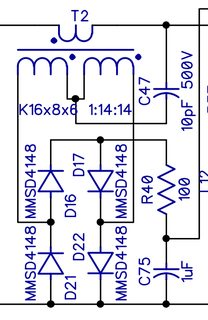
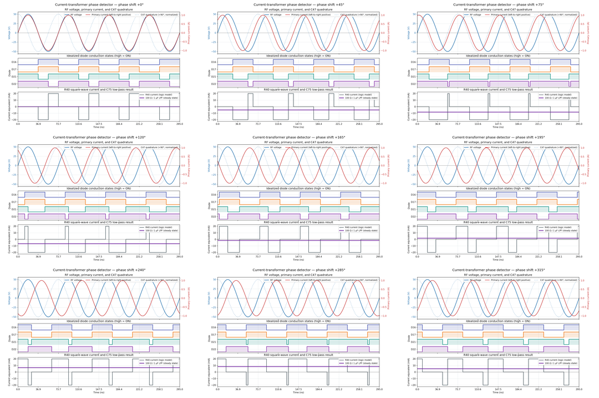
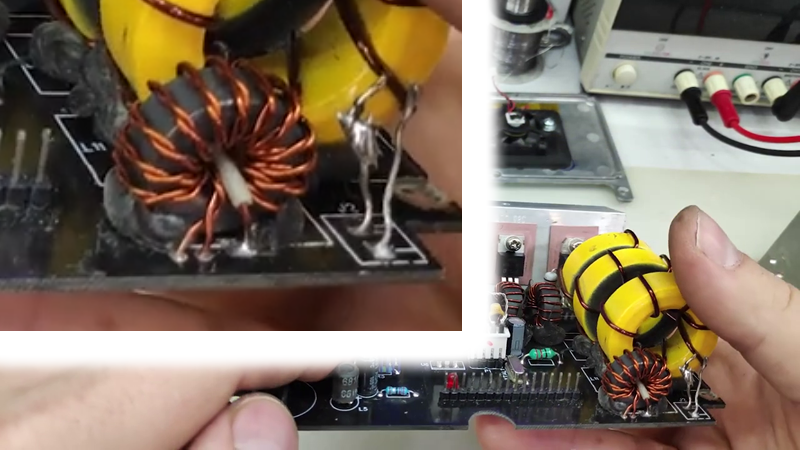
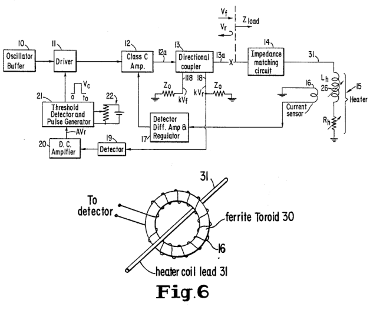
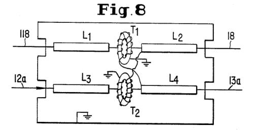
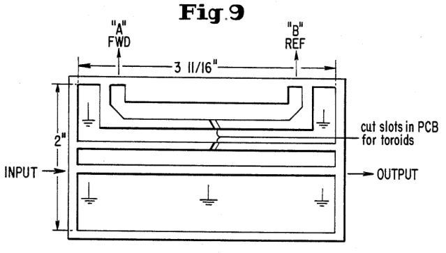

In SergeyMax’s design, there is a current transformer at the RF output. It is using one of the same toroid cores that’s used in other places in this design. The primary winding is just a single loop of the RF output. The transformer is 1:14:14 so the two secondaries are both 14. The connection that looks almost like a center tap is connected to the RF output through a 10pF capacitor. The output of the transformer goes to something that resembles a full bridge diode rectifier. That goes to what looks like a RC filter before a resistor leading to the feedback network of the main buck converter.

At a simple first glance, I assumed that this was some sort of stability or protection mechanism. More current would mean more signal driven into the feedback network and thus lower the buck converter’s output voltage. I thought maybe this was to compensate for some sort of voltage drop caused by inrush, maybe the buck converter overcompensated for voltage drops like that, and needed something to stabilize it.

SergeyMax’s own blog post didn’t really give a clear answer, and other people building his design were also studying it. This forum thread is a goldmine https://www.eevblog.com/forum/projects/i-built-the-diy-metcal-compatible-soldering-station/

TLDR: This is a power factor meter. As the temperature of the iron tip changes, the complex load changes, shifting the phase relationship between RF voltage and current. The tip doesn't need or want more power when it is already hot, and the power factor will change. This current transformer circuit is able to sense this by detecting the phase difference between voltage and current, and then it tells the buck converter to lower its output voltage when the tip doesn't want more power. (technically it also tells the buck converter to raise the voltage when it is cold)

The builder `rfmerrill` posted to the forum thread:

> At first I thought it was a simple current sense circuit, but then I noticed that the RC filter is a lowpass at around 2 kHz, and the diodes are not arranged in a rectifier configuration.
> 
> After poking at it a bit with some friends, we realized this is actually a **ring mixer** that mixes the output current with the output voltage to measure the phase angle between voltage and current! Which makes a ton of sense actually: We want to reduce the output power as the iron tip reaches the curie point. As it does so, the inductance of the iron tip will drop, causing the phase angle between voltage and current to move away from 45 degrees.
> 
> In other words, it's effectively a power factor meter!

later

> Here's how it works:
> 
> Current flows in the same direction on the schematic on primary and secondary side (same polarity voltage = opposite polarity current!)
> 
> The node between D16 and D17 is clamped to approximately +/-2V by the diode ring.
> 
> Because of the above, we can think of C47 as being from the output voltage to essentially ground, as the voltage on the other side of C47 is much greater than 2V in magnitude. Therefore, the current through C47 is approximately the same as it would be were it connected to ground--in quadrature with the output voltage and equal to approx Vout / 1173 ohm (either RMS or peak since it's a sinusoid)
> 
> When primary current is flowing left to right--i.e. towards the soldering iron tip--D16 and D17 are reverse-biased, and therefore no current flows through R40
> 
> When primary current is flowing right to left, the current induced in the secondary flows through D16 and D17, and the additional current injected by C47 has nowhere to go but into R40--until the voltage at that node gets high enough that either D21 or D22 is forward biased. Because the current injected by C47 is so high, this results in R40 effectively seeing a square wave current which you can see in the LTSpice simulation above.
> 
> So if we want to create a simplified model of how R40 is being driven, we can think of it like this:
> 
> - Not driven when primary current is flowing left to right
> - Driven at +2V when primary current is flowing right to left and current is flowing down through C47
> - Driven at -2V when primary current is flowing right to left and current is flowing up through C47
> 
> Because the current through C47 is 90 degrees out of phase with the output voltage we can then reach the conclusion that
> 
> **if the output current and voltage are in-phase, periods 2 and 3 are of equal time and thus the voltage at C1 is zero**
> 
> . Of course, that voltage is also being pulled towards 0.8V via its connection to the feedback loop of the DC-DC, but we'll ignore that for now.
> 
> If the output voltage starts to lead the output current, then period 2 will lengthen and period 3 will shorten, and the voltage on C47 will be pulled higher. Likewise if the current leads the voltage, the inverse will happen and the voltage on C47 will be pulled lower.
> 
> So in essence this is not as dependent on the magnitude of output current and voltage, and much more on the relative phase, which makes sense.
> 

I read what he said, and it was difficult to get a nice graphic out of a simulator to represent it, so I came up with this theoretical signal animation instead:

If you wish to see the individual frames, [click here for all the frame files](./imgs/current_transformer_plots/)

For the three examples of tip temperature states and their resulting waveform:

The numbers used in this model are in this document at the bottom.

## My Own Implementation

The builder `rfmerrill` told me that (over reddit chat)

> I was never able to get it to work until I actually sourced the exact cores from russia

He didn't get the current transformer to work with any of the substitute toroid cores, it only started working once he put in the effort to import some of the Russian ones that SergeyMax used.

The rule of thumb is that for a transformer application, a different AL doesn't mean I have to change the winding ratios, it's a ratio after all.

The toroid core I picked is a Fair-Rite 5961004901. The material is "61", the AL is supposedly higher than the one SergeyMax used, and the datasheet claims that it is a "high frequency NiZn ferrite material developed for a range of inductive applications up to 25 MHz".

On paper, this current transformer is behaving almost like a digital component because of the way the diodes clamp the voltage. The current transformer and the 10pF capacitor really just need to provide enough signal strength to actually cause the diodes to conduct. So this means the Fair-Rite substitute should work better, in a sense. But the concern is that the different material causes a phase delay from primary to secondary, which would obviously ruin the whole thing as the whole point is to measure the phase difference between voltage and current.

I planned out the winding in 3D with consideration for my transformer PCB footprint. All wires are to be 22 AWG (SergeyMax used 0.6mm). There isn't many photos of this component so I thought a 3D model would help a ton.

The two secondary wires are first twisted together, and then wound around the toroid, crossing the center of the toroid 14 times. A twisted bifilar winding implementation.

Also, it's hard to get the directions wrong, because the directions for the current flow (the primary current must be in the opposite direction of the secondaries) are actually dictated by the PCB design, not the winding direction. You can wind it clockwise or counterclockwise and it is theoretically going to do the same thing physically. But, do not criss-cross at the bottom!

## Screenshot From SergeyMax's Follow-up Video

He did say that if you screw this up, it could make the circuit do the opposite, which is boosting the voltage when it should be lowering it. I have spent a ton of time making sure I did not make this mistake.

## Iron Tip Model

For simulations, it is useful to know how to model the iron tip as if it was a complex load.

I got these measurements from http://randomfunprojects.co.uk/metcal.html

Measurements at 13.56 MHz of a STTC-147 tip

| Tip state | Resistance, R (Ω) | Reactance, X (Ω) | Equiv. component | SWR  | S11  |
| --------- | ----------------: | ---------------: | ---------------: | ---: | ---: |
| Cold                                | 42.3 | +j13 |     153 nH      | 1.4 |  -16 dB |
| Warm (below Curie temperature) | 55   | -j16 |     730 pF      | 1.1 |  -23 dB |
| Hot (above Curie temperature)  | 12   | +j24 |     280 nH      | 5.1 | -3.4 dB |

## Relevant Patent

[US Patent US4795886A, filed by Metcal in 1986](https://patents.google.com/patent/US4795886A/en), describes the first embodiment of this, although it was different.

The patent’s preferred embodiment uses a directional coupler to measure reflected-voltage magnitude. It does not measure the phase of the reflected wave, so it does not obtain the complete complex reflection coefficient. Our implementation instead measures the phase relationship between load voltage and current, which is another indicator of the changing load impedance.

> When the current to the load exceeds the desired constant magnitude, the voltage induced across coil 16 causes the regulator 17 to decrease the voltage fed to the collector of the final stage of the power supply, namely the Class C amplifier 12. To achieve this function, the detector, differential amplifier and regulator 17 has an adjustable reference voltage against which the voltage across coil 16 is compared. If the voltage across coil 16 exceeds the reference voltage, the regulator 17 lowers the collector voltage to the Class C amplifier 12, until the two volt ages are equal. Similarly, if the voltage across coil 16 is lower than the reference voltage, the regulator senses the difference and raises the voltage to the Class C amplifier until the voltage across coil 16 equals the reference voltage. If the Class C amplifier is of the vacuum tube type, the regulator 17 controls the plate voltage of that amplifier.

Fun, our modern implementation adjusts the voltage being output by the buck converter. This is saying something similar, except it is only using voltage on the coil as the feedback signal, not the phase. (you can see why me and others have been confused by this current transformer's purpose)

The patent's preferred embodiment turns off the RF for a fixed time duration when the iron tip is too hot (reflected voltage exceeds an adjustable threshold associated with a temperature near the effective Curie point)

> When the reflected voltage signal from output 18 produces a voltage that exceeds the reference voltage from circuit 22, the Schmitt trigger produces an output signal which actuates a monostable 21b multivibrator which produces an output signal V_c of a predetermined length, to V_c can turn off the driver transistor by using it to bias the base of a common emitter amplifier stage.

later

> Since the cooling load is small the heater may still be at the effective Curie when time period to expires in which event the driver and Class C amplifier will be turned back on, but since there would then still be a reflected voltage at output 18 the multivibrator would be turned back on almost instantly starting a new off period for a time period to. Thus, the radio frequency power to heater 15 would be cycled on and off with the "off" periods being relatively long as compared to the "on" periods. On the other hand if the cooling load was large the same events would occur except that there would be greater cooling of heater 15 during the time periods to, and the "off" periods would usually be shorter than the "on" periods.

Although it also mentions reducing the current as an alternative implementation

> Instead of turning current on and off for controlling the temperature of the load 15, the apparatus may be designed to simply reduce the current.

Interestingly, even though we think of these RF irons as having one fixed temperature as determined by the tip's Curie temperature, this patent also describes a way of controlling the temperature.

> As the temperature approaches T_c, V_r will increase above this residual voltage. The threshold detector 21, 22 can be set to trigger at any temperature in the range perhaps T_3 to T_c. Thus we have available a range of possible operating temperatures near T_c.

> Though it is theoretically possible to vary the operating temperature over the entire range from approximately T_3 to T_c it is probably desirable to maintain it substantially below the effective Curie temperature T_c at all times in order to maintain the good amplifier efficiency and stability referred to previously as one of the advantages of this approach. A large value of V_r, corresponds to a high degree of mismatch between the Class C amplifier 12 and the load 14, 15. This in turn lowers the efficiency of the amplifier output. Thus operation at temperatures ranging from T_3 up to a temperature T_4, at which amplifier efficiency and stability are still high, is desirable.
