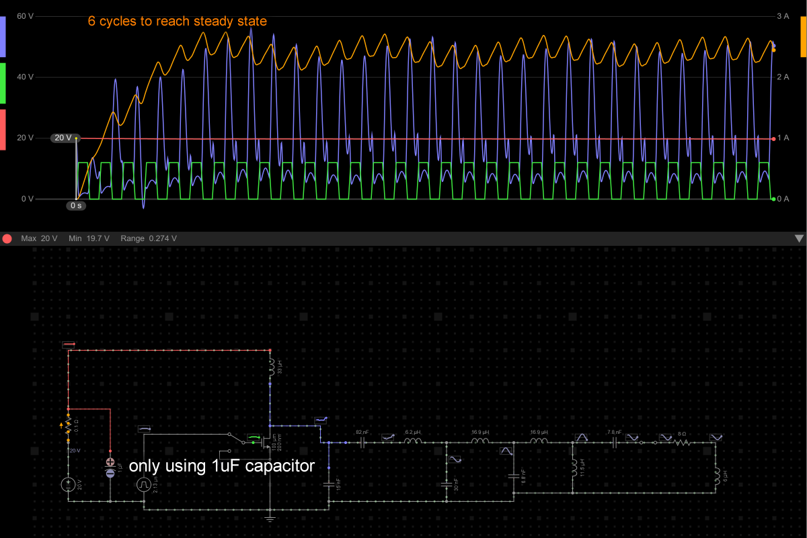
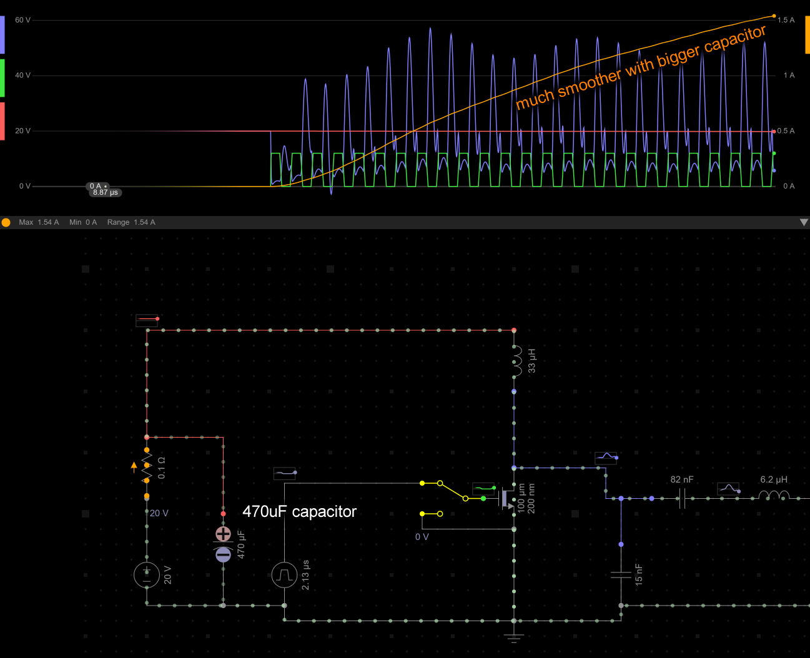
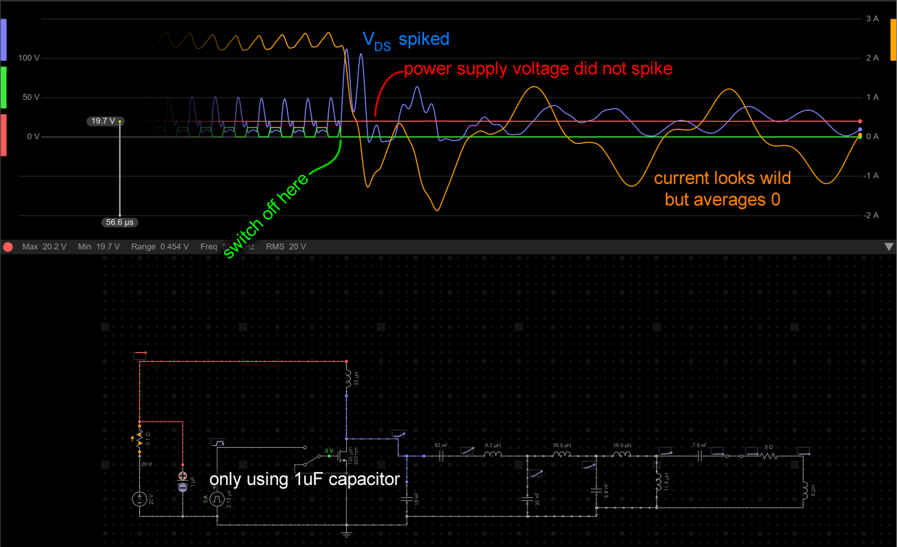
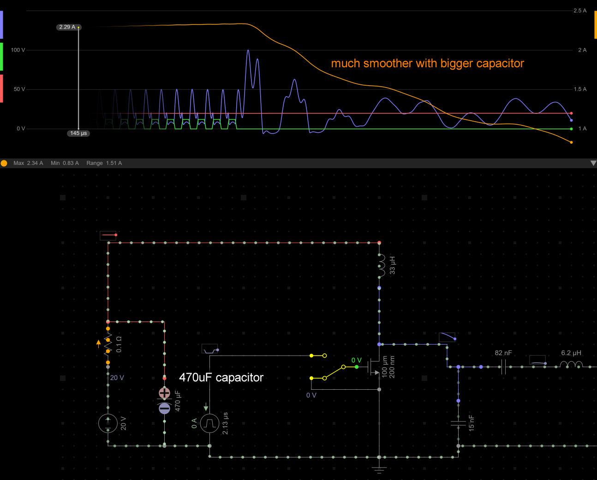

## Goal

For the Lite 470 kHz version that is a copy of Radio Thermal's design, which is asking for a 20V 5A power supply, this is a little tricky. The problem is that, the premise of the project is to add USB-PD as a power input, but, only the USB-C cables with a E-marker inside are capable of 5A. This is very annoying and I'd like to implement a reduced power mode just so it would work with 3A instead, which can make it work with normal USB-C cables and 65W USB-C chargers. The constraint is that we cannot add a buck converter into the design.

(For the full 13.56 MHz version, reducing power is a simple matter of reducing the voltage provided by the buck converter.)

I understand that 20V and 3A is about 60W, and RF irons like these are not efficient so we are expecting maybe 30-40W of heat. This is deemed totally acceptable. Even a 30W iron, if it is responsive, feels great to use in 90% of soldering situations. This is about giving just a few more options to the user, they can still power it with full 5A if they choose to.

## Ideas

Something different I've done from Radio Thermal's design is to use a Seeed Studio XIAO microcontroller which generates the 470 kHz, this allows DIY builders to avoid having to buy any programming equipment, as code is flashed via a USB connector.

Having this flexibility, the first explored option is to simply turn on the iron for a period of time and turn it off for a period of time. If we do this really fast, like 5ms on, and 5ms off, the user won't notice the interruption in heat, and won't be bothered by the coil whine (100 Hz hum). Once you get into the 1ms range you might start to hear an annoying 1 kHz tone.

The issue with that idea is that the current will probably still spike to 5A anyways for 5ms, and trigger the over-current protection that's set at 3A if you've negotiated for 3A over USB-PD.

Realistically, the over-current protection doesn't trigger immediately, it takes a few microseconds to trigger, they are usually tolerant of things like the device having a large input capacitor that causes a brief in-rush, plus, they also have their own output capacitor.

Doing long periods like 10ms or even 1ms is easy for the microcontroller. I don't really want to use any periods that can cause an audible tone, and once you get down into the microseconds, the interrupt execution times become a problem.

The firmware design was changed, I switched to using a DMA to feed each individual pulse into the PWM generator. Each power level corresponded to a pattern stored in a table. A PWM pattern like `101010101010` would be 100% power, and I can do things like `101000101000` to reduce the power consumed, that was the idea, kind of a pulse-density modulation. The hope was that the very short period of high consumption, now on the scale of microseconds, would be masked by the capacitor and skip being detected as over-current by the USB host.

(I have explored using SPI or UART to do this, but PWM is the best method here)

But this won't work as is, I'm not dumb, I've already modeled out the way the RF amplifier ramps up. It takes 6-12 clock cycles for it to ramp up to a steady resonating power amp. If you miss a single cycle, it collapses and is basically chaotic enough that restarting will take another 6-12 clock cycles. The good news is that, 12 clock cycles is super short in context and could fly under the 3A radar.

## Simulations

When turning ON the RF wave input

-----

-----
When turning OFF the RF wave input

-----

## Final Implementation

So the firmware was changed (I started writing the firmware like 2 weeks before manufacturing of the PCB), so that the pattern table now always starts with 12 carrier cycles (26 microseconds). The code that generates the pattern now inserts more cycles or more blank time (ie. off time) in order to satisfy an average power being requested, all done during run-time.

The first 12 cycles represents a ramp so it's considered 80% average power instead of 100%. If you loop these then you get 100% average power. If you do 12 cycles on and 12 cycles blank then the algorithm considers this about 40%. The algorithm adds more cycles or more blank time depending on the average power requested.

When a blank time starts, the voltages and currents don't just start decaying, noooo, it's not bouncing back and forth at 470 kHz either (if it did, then restarting the amp would be cleaner), it's chaotic. Without a carrier, it doesn't go into the iron tip, but without the MOSFET being on, it doesn't dissipate into ground. No amount of tuning can get this perfect. It does still slowly chill out, so the algorithm is written to enforce a minimum length for any blank periods so that any restart is unlikely to cause some catastrophic spike. The average power calculations are always done with this in consideration.

The major concern is power back-flowing into the USB host. When I added the 470 uF capacitor into the simulation model, this stops being a problem. Napkin math says the capacitor voltage will rise maybe only `0.04V` from the left over energy. It's not THAT much energy in context.

## Upgrading the MOSFET

At some point in September of 2026, on Radio Thermal's Discord, there was one user who asked if it was possible to have multiple handpieces connected at once, not all powered at once, but quickly switched.

This should be easy, even a cheap power switch can handle the current involved, and 470 kHz isn't that high to worry about. The only question left is, if the circuit can handle the open circuit load. Radio Thermal authors posted a few LTspice simulations for people to play with, with different tip loading conditions and VDS measurements already inside.

Given that my design can use a 28V USB-PD input or lithium battery input, I got some results for 30V, and it pointed me to wanting to update the MOSFET to a IXFP26N30X3, it has a 300V VDS rating and a lower gate charge (less heat from the gate driver circuit). In many other ways it is better than the IRF640NPBF that the original Radio Thermal design uses, but it is more expensive. There is also a protection TVS diode SMCJ150CA (SergeyMax actually used a SM15T150CA) that is added as insurance.

Ok the reality is, the peak VDS simulated for a 30V input is about 151V, the SM15T150CA is actually going to conduct a bit before that at 128V so I changed it to a SMCJ150CA, then, the SMCJ150CA's clamping voltage is what made me want a IXFP30N25X3 rated at 250V, but it's $9 (the IRF640NPBF is like $2), and the IXFP26N30X3 is like $6 with a 300V VDS rating and similar other specs. Admittedly all of this is WAYYYYYY overkill, but I'm only doing this once and these are gifts to friends. Plus, from the experiences of the builders of the SergeyMax design, and how I am doing bursty input power, I wanted this to be bulletproof.

Another thing I noticed is that the IRF640NPBF has a gate charge of 67nC (at 10V) and napkin math says that it's going to cost like a bit over 0.3W of heat to drive it. I wanted to keep the resistors simple 0.1W resistors in the gate driver circuit. So IXFP26N30X3 having a 22nC (at 10V) gate charge helps a ton. What's also odd, Radio Thermal's authors only specified 5 ohms for that resistor, it's a 0805 package on the layout, but they did not specify a part number, it's missing from their BOM, and 5 ohm is not a E24 or E96 value. My own design started off using two 3.6 ohm resistors anyways so I didn't bother pushing this issue. SR0805FR-475R1L (5.1 ohm) or CRCW08054R99FKEAHP (4.99 ohm) would work as 5 ohm 0.5W 0805 resistors and are not hideously expensive for a one-off project.
