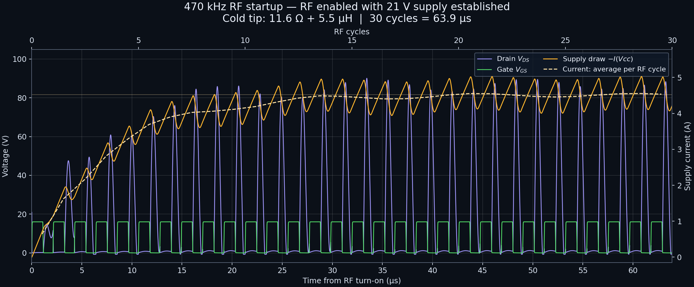

# 470 kHz RF startup



Actual LTspice 26.0.2 transient results, using the circuit in
[`from_discord_sept5_2026.asc`](from_discord_sept5_2026.asc), with the **cold tip**
selected. The source schematic is unchanged. The main plot shows RF switching
starting with the **21 V DC supply already established**, matching the turn-on
scenario in [`sim-lite-rfgen-start.png`](../imgs/sim-lite-rfgen-start.png).
The circuit and load differ from that reference, so the amplitudes and settling
time differ too.

## Reading the plot

- **Green, left axis:** `V(Vgs)`, external gate-to-source voltage. M1's source is grounded.
- **Purple, left axis:** `V(Vds)`, drain-to-source voltage.
- **Orange, right axis:** `-I(Vcc)`, instantaneous current drawn from the 21 V source.
  LTspice defines source current into its positive terminal, so the minus sign
  makes delivered current positive. This excludes the separate ideal gate-drive supply.
- **Dashed cream, right axis:** time-weighted current average over each RF period;
  the faint horizontal line is the settled average. The dashed trace is calculated
  by the Python plotting script, not an additional simulated circuit element.

The 30 µH feed choke prevents its current from changing instantly. RF switching
builds up energy in the choke and resonant network, so average supply current
rises over the first several cycles. The orange RF ripple remains in steady
state; steady state here means a repeating waveform, not constant current.
There is also a decaying envelope oscillation, so the rise is not strictly monotonic.

| Measurement | RF turn-on, established supply |
|---|---:|
| First-cycle average supply current | 0.647 A |
| Cycle 30 average supply current | 4.535 A |
| Settled average supply current | 4.519 A |
| Settled peak VDS | 87.01 V |
| Maximum VDS in the displayed 30 cycles | 90.09 V |
| Settling to the criterion below | Cycle 47, starting at 97.98 µs |

The plot looks close to settled by 30 cycles, but **“6 cycles to steady state”
does not apply to this circuit**. For a quantitative check, the simulation runs
to 1 ms. The reference values are averages of the last ten complete cycles.
Settling means both cycle-average supply current and per-cycle peak VDS remain
within 1% of their respective references for all remaining complete cycles.
This checks those two metrics, rather than every point of every circuit waveform.

## Simulation settings

The original directive is:

```spice
.tran 0 1004.21u 1000u 5n startup
```

It discards data before 1000 µs, hiding the entire startup. For the main plot use:

```spice
.tran 0 1m 0 5n
.param TipVal=1
.options plotwinsize=0
.save V(Vgs) V(Vds) V(Vdc) I(Vcc)
```

Replace the original `.step param TipVal 1 4 1` with `.param TipVal=1`;
do not leave both active. Keep the source's `R_tip` and `L_tip` parameter tables.

| Parameter | Value and purpose |
|---|---|
| Stop time | `1m`: 1 ms, to verify the eventual periodic state |
| Start saving data | `0`: retain the startup |
| Maximum timestep | `5n`: 5 ns, resolving the 50 ns drive edges |
| First `.tran` argument | `0`: let LTspice choose adaptive sampling |
| `startup` / `uic` | Neither is used for the main plot; solve the ordinary DC operating point with the gate initially low |
| Waveform compression | `plotwinsize=0`: retain all calculated samples |
| Display window | 0–63.9 µs: exactly 30 periods |
| Vcc | 21 V, unchanged |
| Gate source | `PULSE(0 16 0 50n 50n 1.065u 2.13u)`, `Rser=5`, unchanged |
| RF period / frequency | 2.13 µs / 469.484 kHz (nominally 470 kHz) |
| Pulse timing | No delay; 50 ns rise and fall; 1.065 µs high plateau. Finite edges make this slightly different from an ideal 50% square wave |
| Cold-tip model | `TipVal=1`: 11.6 Ω + 5.5 µH; the separate 0.1 Ω inductor series resistance and 0.5 Ω cable resistance are retained |
| MOSFET / network | Original FDP18N20F VDMOS model, component values and specified parasitics |

For a shorter run containing only the displayed window, use `.tran 0 63.9u 0 5n`.
That is sufficient to generate the image but insufficient to reproduce the
1 ms settling check.

## Reproduce in LTspice

1. Open [`startup_rf.cir`](startup_rf.cir) and run it. This is a self-contained
   netlist with the MOSFET model included. Alternatively, save a copy of the
   original schematic and apply the directive changes above.
2. In the waveform viewer, use **Add Trace** to add `V(Vgs)`, `V(Vds)` and
   `-I(Vcc)`. Voltage uses the left axis and current the right axis.
3. Right-click the time axis and set its left limit to `0`, right limit to
   `63.9u`, and tick interval to `5u`. A voltage range of −5 to 105 V and a
   current range of about −0.15 to 5.8 A match the main image.
4. Save the waveform plot settings through the waveform viewer's **Save Plot
   Settings** command if you want LTspice to remember the traces and zoom.
   The PNG's styling, cycle axis and dashed cycle-average overlay are generated
   by Python; the three instantaneous traces are directly from LTspice.

The batch schematic-to-netlist command stalled in this environment, so the
provided `.cir` files were transcribed from the schematic's wires and component
attributes, with internal node names assigned for the series network. The
original broad-window `.meas` directives were omitted; the supplied Python
script computes explicitly defined startup and settling metrics instead.

## Original `startup` supply-ramp behavior


[`startup_supply_ramp.cir`](startup_supply_ramp.cir) differs from the main netlist
only by retaining the `startup` modifier:

```spice
.tran 0 1m 0 5n startup
```

Here the DC supply ramps from zero to 21 V over 20 µs, as the red trace shows.
The gate pulse source begins switching at time zero, as shown by the green
trace. This produces a different startup envelope: by cycle 30 the average
current is 4.513 A, and the 1% settling criterion is satisfied from cycle 23
(46.86 µs). Both simulations reach essentially the same periodic state.

Use this version to examine the original schematic's startup assumption; use
the main version for RF being enabled on an already-powered rail. Neither
version models a specific physical supply's turn-on or current limiting.
The tip impedance stays fixed during each run; this is electrical settling,
not a simulation of the tip heating through its Curie temperature.

LTspice's time-window syntax and startup behavior are described in Analog
Devices' [simulation troubleshooting reference](https://analogdevicesinc.github.io/ltspice-reference/ai_ref/TROUBLESHOOTING-GUIDE.html)
and [simulation command reference sheet](https://www.analog.com/media/en/news-marketing-collateral/solutions-bulletins-brochures/ltspice-keyboard-shortcuts.pdf).

## Files and exact PNG regeneration

The two `.cir` files are runnable inputs; their `.raw` files retain the full
1 ms transient data, and `.log` files record the successful LTspice runs.
[`startup_metrics.json`](startup_metrics.json) contains the summary metrics;
[`startup_rf_cycles.csv`](startup_rf_cycles.csv) and
[`startup_supply_ramp_cycles.csv`](startup_supply_ramp_cycles.csv) contain the
per-cycle averages and peaks.

Run these PowerShell commands **from this directory**, adjusting the executable
path if LTspice is installed elsewhere:

```powershell
$ltspiceExe = "$env:LOCALAPPDATA\Programs\ADI\LTspice\LTspice.exe"
foreach ($deck in @('startup_rf.cir', 'startup_supply_ramp.cir')) {
    $deckPath = (Resolve-Path $deck).Path
    Start-Process -FilePath $ltspiceExe -ArgumentList ('-b "{0}"' -f $deckPath) -WindowStyle Hidden -Wait
}
python -m pip install numpy matplotlib
python .\plot_startup.py
```

If the saved `.raw` files are already present, only the Python commands are
needed. The script expects ordinary binary transient RAW output, not ASCII or
Fast Access format. It creates both PNGs, both cycle CSVs and the metrics JSON.

Validation: both 1 ms simulations completed successfully with LTspice 26.0.2,
normal solver, trapezoidal integration, 27 °C. Repeating the main simulation
with a 2.5 ns maximum timestep changed the first 30 cycles' averages by at most
0.000282 A and their peak VDS values by at most 0.0151 V. The figures were also
visually checked. These are model predictions using the supplied circuit,
not measurements of hardware.
