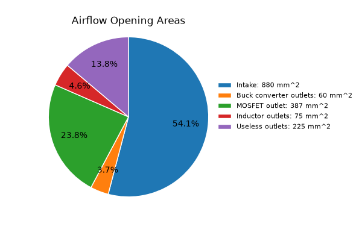
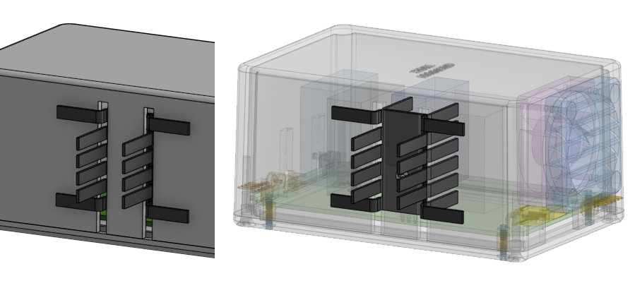
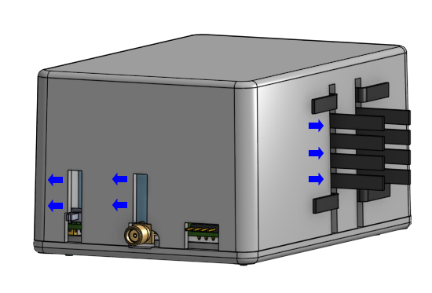

When the project started, it didn't look like SergeyMax focused on thermal very much. The box is plain looking without vent holes and the MOSFETs only have very small heatsinks.

Here's a fun question to hold in your head: Why are the actual Metcal or Thermaltronics stations so gigantic when SergeyMax's unit look so small? The differences are huge.

The builder over at EEVblog named `rfmerrill` has a photo of his own build and he stuck the MOSFETs against the enclosure wall with some thermal pads in between.

`rfmerrill` did mention that:

> recommend connecting a nearby ground to Q2's screw to shunt the capacitive coupled noise that will otherwise return through the housing and output jack

also

> Switch the main power transistor back to the "good" silpad from the cheap amazon one (which I used briefly because I couldn't find the good ones)

Years later, SergeyMax released a follow-up video. In it, his own unit has operated for a few years but he added a gigantic heatsink and a small cooling fan to it

This prompted me to update my design. I will put a Noctua NF-A4x10 fan inside mine. I use these fans in many places, such as on my 3D printer and a they also cool my archival external hard-drives. They are quiet and last for years.

The plan is to mount it inside the enclosure on the side, on the wall where the power input connectors are. I chose a side mount instead a top mount to lessen the chance of something falling inside the enclosure.

The MOSFETs will be mounted against a large square heatsink. The legs will have to be bent a lot for the back of the TO-220 to reach the heatsink. The heatsink is also attached to the outside of the aluminum enclosure. The assembly of this arrangement should be straight forward.

It's hidden but there is an air exit at the foot of the MOSFETs. There is a 3D printed air-duct that will redirect exiting airflow up through the heatsink fins.

To encourage the airflow through this exit, all other air escape gaps not useful for cooling are covered by 3D printed features.

To further prevent debris from entering the enclosure, a louvered air intake grille is 3D printed, with slats facing downwards.

Back to the question I posed at the start: The Metcal stations are meant for 24/7 non-stop factory operations over decades, it wants to have no moving parts, no possible dust or liquid ingress, so it's a gigantic chunk of aluminum. They remind me of those industrial computers that are also chunks of aluminum with no fans.

Our little portable DIY version of this station is definitely going to need some considerations for thermal dissipation.

## Buck Converter Cooling

The PCB is made with 2oz thick copper for better heat dissipation. This is important for the `TPS54560` buck converter. There are some vent air exit slits near where the buck converter is. That region has a brass standoff connecting that copper pour to the bottom plate of the enclosure. I also soldered on some copper cooling fins to the exposed copper pour in that region.

The `TPS54560` buck converter has its own junction thermal limit.

## Fan Control

The fan is powered by 12V. The 12V comes from a secondary buck converter and is rated for 2A. The fan is controlled by a small MOSFET. As the fan only needs about 50mA, none of this is concerning.

The fan is controlled by the microcontroller. The microcontroller drives the MOSFET, and the MOSFET is used for low-side switching the fan. Additionally, the circuit can be reconfigured:

 * the microcontroller can drive a PWM signal directly
 * the MOSFET can drive a PWM signal as open-drain (the microcontroller will invert the signal)
 * the MOSFET can be driven with PWM and attempt to speed-control a fan that lack PWM inputs

The firmware allows the user to pick between 16 different fan control modes, in three broad categories:

 * simple and force the fan to a certain speed
 * automatic modes triggered by a particular temperature threshold
 * adaptive modes that adjusts fan speed based on temperature detected

## Temperature Sensors

The microcontroller always has its own internal temperature sensor that is being monitored, but it is questionable if this is useful, as it is placed very far away from RF and power components.

There are connections and voltage dividers for two NTC thermistors. These are optional, but I have attached the NTC thermistors to the plastic casing of the two main MOSFETs.

The thermistor is 10 kohm at 25C and have beta of 3950K, a 2.2 kohm pull-up resistor towards 3.3V is used to implement a voltage divider.

| Temp (C) | ADC reading |
|----------|-------------|
| 0        | 960         |
| 25       | 839         |
| 50       | 634         |
| 75       | 413         |
| 100      | 246         |
| 125      | 143         |
| 150      | 85          |

Candidates for NTC thermistor: NRL2104J3950B1F (wire leads) or NRNE104H3950B1H (through hole)

## Resistor Changes from Original Design

In SergeyMax's design, he used two 2.2 ohm resistors in series (doing both source and sink) between the output of his MAX17602 and the IRF510 MOSFET. The foorprint are 0805 and the power rating is not specified, but I think 0805 can go up to 0.5W if you shop hard enough. In my design, I have two 3.6 ohm resistors here doing the same job, one for source and one for sink. Calculations showed that these should be worst case 0.75W rated so I used a 1206 footprint instead.

The 22 ohm resistor used at the input of the tip-detector circuit is an ordinary 0805 footprint resistor in SergeyMax's design. Many EEVBlog users reported that this resistor tended to fail when the tip is actually removed. In my design, these have been beefed up to a 2512 footprint resistor rated for 2W. Better safe than sorry.

At the gate of the main amp MOSFET, there are 150 ohm resistors that SergeyMax specified to be 2W rated and he used a axial package. In my design, I still used a 2W rating but I used a SMD 2512 package, with plenty of ground stitching vias (and 2oz copper PCB). for 12V DC conditions, 150 ohm should cause a bit under 1W of heat, and this net is supposed to be a 12V RF gate clock so we expect a bit less.

## Airflow Napkin Math

(note: numbers are from the design on August 26 2026, final numbers may have changed)

Intake area: fan represented as two circles, 38mm OD and 18mm ID, giving an oriface area of 880mm^2

Outlets for buck converter cooling: 40mm^2 to 60mm^2

Outlet for MOSFET cooling: 45mm x 8.6mm = 387mm^2

Outlets for inductor cooling: 2x or 4x or 6x 4mm diameter holes, oriface area ranging from 25mm^2 to 75mm^2

Useless outlets: 25mm x 5mm and 20mm x 5mm, 225mm^2 total

Generated using `doc\tools\airflow_pie_chart.py`

This rough estimate only tells me:
 * I can afford to have those 6 holes for the toroid cooling, maybe even more. The magnetic properties of those toroids do depend on temperature a bit.
 * I should put in an effort into mimizing the useless air outlets

## Cooling for the Lite Version

I've met with the developers of Radio Thermal, I commented on how big their design is but most of it was taken up by the fan. They replied that it does still work without the fan, but they do not make claims about its performance without the fan.

In my design, there's still a fan and a heatsink (actually two heatsinks stuck together) on the MOSFET. The air is blowing against the heatsink and the toroids internally.

