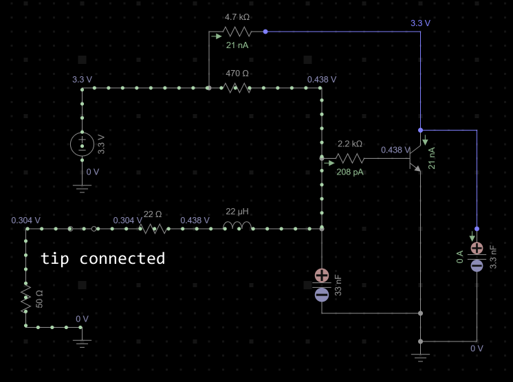
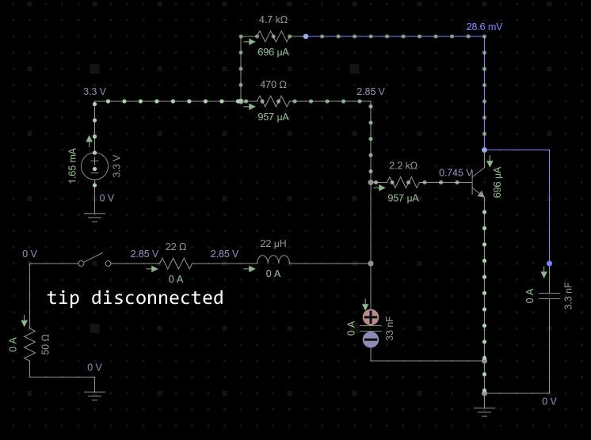

# Tip Detector

The tip detector shuts down RF generation when the handpiece or cartridge becomes electrically disconnected. A disconnected load also causes the RF output voltage and the class-E MOSFET drain voltage to rise, but that voltage rise is not what this circuit directly measures.

The circuit is primarily a **DC continuity detector with an RF low-pass filter**. It injects a few milliamps of DC into the RF output. A connected cartridge provides a low-resistance DC path to ground and holds the detector low. An open connector or cartridge removes that path, allowing the bias voltage to turn on Q3.

(There is no diode RF rectifier or calibrated envelope detector in this circuit. Residual RF could be rectified by Q3's base-emitter junction, but that is an unwanted secondary effect and not the intended detection mechanism.)

## Circuit

The relevant portion of the circuit is approximately:

```text
3.3 V -- R19 470 ohm --------------+
                                   |
                                   |
RF-OUT -- R21 22 ohm -- L9 22 uH --+-- R22 2.2 kohm -- Q3 base
                                   |
                                C42 33 nF
                                   |
                                  GND


3.3 V -- R18 4.7 kohm --+-- (microcontroller GPIO)
                        |
                        |
                    Q3 collector


Q3 emitter -- GND
```

The output logic is active-low:

| Physical state   | Q3        | `TIP-DET` / PA5   |
|------------------|-----------|-------------------|
| Tip connected    | Off       | High: tip present |
| Tip disconnected | Saturated | Low: tip absent   |





## DC Operation

At DC, L9 is approximately a short circuit and C42 is an open circuit. The detector therefore sees the DC resistance of the cable, connector, handpiece, and cartridge through R21.

Define:

```text
RBIAS = R19 = 470 ohm
RLOAD = R21 + resistance of cable, connectors, handpiece, and tip
RBASE = R22 = 2200 ohm
```

Before Q3 starts conducting, the detector-node voltage is approximately the ordinary divider result:

```text
VDET = 3.3 * RLOAD / (RBIAS + RLOAD)
```

With a connected tip whose complete DC loop resistance is only a few ohms, `RLOAD` is dominated by R21's 22 ohms. For example, using 2 ohms for the external loop gives:

```text
VDET = 3.3 * 24 / (470 + 24) = 0.160 V
```

This voltage is far below the base-emitter voltage needed to turn on Q3, so Q3 remains off. The DC continuity-test current is approximately:

```text
ITEST = 3.3 / (RBIAS + RLOAD)
```

For the illustrative 2-ohm external loop, the normal test current is:

```text
ITEST = 3.3 / (470 + 24) = 6.68 mA
```

This is too small to heat the cartridge appreciably.

When the tip is disconnected, `RLOAD` becomes effectively infinite. The 3.3 V bias then flows through `RBIAS`, `RBASE`, and Q3's base-emitter junction. Using a nominal `VBE` of 0.65 V:

```text
IB = (3.3 - 0.65) / (470 + 2200) = 0.99 mA
```

R18 only asks Q3 to sink approximately:

```text
IC = (3.3 - VCE(sat)) / 4700 = approximately 0.66 mA
```

The available base current is consequently much greater than necessary, so an open tip drives Q3 deeply into saturation. The [BC846B datasheet](https://assets.nexperia.com/documents/data-sheet/BC846_SER.pdf) specifies the B gain group at `hFE = 200` to `450` at 2 mA and gives a maximum `VCE(sat)` of 0.2 V under its stated saturation test. Even using 0.2 V as a conservative collector-low estimate, the result is safely below the STM32's guaranteed low-input limit.

### Approximate resistance trip point

At the instant Q3 begins to turn on, base current is still small. Taking `VBE = 0.65 V`, the approximate external-loop resistance that raises the detector node to the switching point is:

```text
RLOOP(trip) = VBE * RBIAS / (3.3 - VBE) - R21
```

With VR2 shorted, this gives approximately:

```text
RLOOP(trip) = 93 ohm
```

This is not a precision threshold. `VBE` varies with collector current, temperature, and transistor sample; the BC846B datasheet indicates roughly -2 mV/degree C. Cable resistance, inductor winding resistance, contamination, and connector contact resistance also contribute. The useful conclusion is that **a normal low-resistance cartridge looks decisively connected, while an open circuit looks decisively disconnected**.

### Optional VR2 test-current adjustment

VR2 is not needed for normal operation. Its only intended use is to insert extra series resistance when testing different continuity currents. Adding resistance also changes the approximate resistance trip point, so the choice is not completely independent of detection behavior.

Using the same illustrative 2-ohm external loop:

| Resistance inserted at VR2 | Test current | Approximate external-loop trip resistance |
| ---: | ---: | ---: |
| 0 ohm, normal short | 6.68 mA | 93 ohm |
| 330 ohm | 4.00 mA | 174 ohm |
| 680 ohm | 2.81 mA | 260 ohm |
| 1000 ohm | 2.21 mA | 339 ohm |

Unless there is a specific reason to reduce the test current, VR2 should remain shorted. VR3 also remains shorted; R22 alone provides ample base-current limiting.

With the output open and before Q3 conducts, C42 charges through `RBIAS`. Its full charging time constant is:

```text
tauDET = RBIAS * C42 = 470 ohm * 33 nF = 15.5 us
```

It does not need to charge to 3.3 V to cause a transition. Starting near zero, the ideal time to reach 0.65 V is only:

```text
tTRIP = -tauDET * ln(1 - 0.65 / 3.3)
      = 0.219 * tauDET
      = 3.4 us
```

Base current and parasitic capacitances change the real waveform, but this shows that the detector-node transition is naturally in the microsecond range rather than milliseconds. On reconnection, C42 discharges through R21 and the low-resistance tip loop and therefore falls still faster.

## Rejection of the 13.56 MHz Signal

R21, L9, and C42 form a second-order low-pass network. Its ideal undamped natural frequency is:

```text
f0 = 1 / (2 * pi * sqrt(L * C))
   = 1 / (2 * pi * sqrt(22 uH * 33 nF))
   = 187 kHz
```

At 13.56 MHz, the ideal component reactances are:

```text
XL = 2 * pi * f * L
   = 2 * pi * 13.56 MHz * 22 uH
   = 1874 ohm

XC = 1 / (2 * pi * f * C)
   = 1 / (2 * pi * 13.56 MHz * 33 nF)
   = 0.356 ohm
```

The inductor therefore presents a large series impedance to RF while C42 holds the detector node close to RF ground. Treating the components as ideal and ignoring the relatively light bias-network loading, the RF transfer magnitude is approximately:

```text
|VDET / VRF| = |XC| / sqrt(R21^2 + (XL - XC)^2)
              = 0.000190
              = -74.4 dB
```

For illustration, 100 V peak at `RF-OUT` would produce only about 19 mV peak at the detector node in this ideal calculation. This is why describing the network merely as an "LC filter that triggers on high RF voltage" is misleading: its purpose is to keep the RF away from Q3 while allowing the DC continuity measurement through.

R21 limits current and damps the LC network. Real attenuation will differ because L9 has winding resistance, inter-winding capacitance, and a self-resonant frequency, while PCB and transistor capacitances add other RF paths. Those parasitics should be checked on the assembled board, but they do not change the basic DC-continuity operating principle.

## Collector Filtering and Logic Levels

R18 pulls `TIP-DET` to 3.3 V while C41 filters the collector signal. When Q3 is off, their time constant and corner frequency are:

```text
tau = R18 * C41 = 4.7 kohm * 3.3 nF = 15.5 us
fc  = 1 / (2 * pi * R18 * C41) = 10.3 kHz
```

The corresponding 10% to 90% rising time is approximately:

```text
tr = 2.2 * tau = 34 us
```

The falling edge is also fast because Q3 actively discharges C41. This capacitor suppresses very short disturbances and keeps RF pickup away from the microcontroller input.

At a 3.3 V MCU supply, the conservative all-I/O limits in the [STM32F042 datasheet](https://www.st.com/resource/en/datasheet/stm32f042g4.pdf) are no more than 0.99 V for a guaranteed low and at least 2.31 V for a guaranteed high. The expected collector levels of approximately 0.2 V or less and 3.3 V have ample margin.

## Firmware Behavior

`TIP-DET` is connected to STM32 pin PA5 and configured for interrupts on both edges. The firmware interprets high as connected and low as disconnected.

On either edge, the EXTI interrupt temporarily masks further tip-detector edges and starts TIM17 as a 300 us one-shot debounce timer. When that timer expires, the firmware samples PA5:

- If PA5 is high, the tip is recorded as present.
- If PA5 is low, the disconnect fault is latched and RF generation is stopped.
- RF cannot start while the fault is latched, while a debounce interval is active, or while the physical input remains low.
- The latch can only be cleared by the user when the debounced state and the live pin both say that the tip is present.

The tip-detector interrupt has the highest maskable firmware priority. That minimizes additional interrupt latency, but it does not remove the deliberate 300 us qualification period.

Combining the analog settling time, the collector filter, and firmware debounce gives a typical response on the order of 0.3 ms to 0.4 ms. At 13.56 MHz, the 300 us debounce alone spans:

```text
13.56 MHz * 300 us = 4068 RF cycles
```

## Protection Limitations

This detector prevents the amplifier from continuing to drive a disconnected load. It cannot prevent the first no-load voltage excursion: energy already stored in the matching-network inductors and capacitors must go somewhere, and even one RF cycle is much faster than the detector and firmware.

Consequently, this circuit does not replace adequate MOSFET voltage rating, the drain-voltage clamp, suitable TVS protection, correct matching-network tuning, or safe PCB layout. It is a sustained-open-load shutdown mechanism, not a cycle-by-cycle overvoltage limiter.

Unlike SergeyMax's automatic retry behavior, this firmware leaves the disconnect fault latched. Once the cartridge is connected again, the user must press the button to acknowledge the replacement before RF generation can restart.
