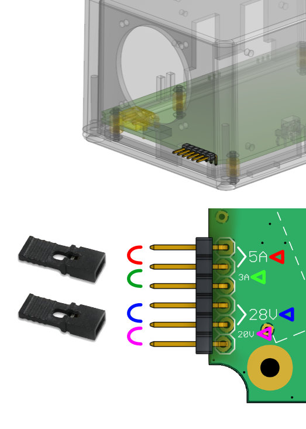

## Normal Operation

When powered up, the soldering iron does not really need any interaction. It just works, much like a Metcal soldering station.

The GUI will display the DC input voltage, and a graph representing power draw. The voltage helps users determine battery voltage or USB host delivered voltage. The power graph show how much power is being consumed by the soldering iron cartridge.

Remember, this is a RF soldering iron, there is no need (and no way) to adjust temperature. The temperature is just magically always correct. Since you are using one and knows it's worth like $1000, I assume this is why you are using one.

Pressing the button quickly will cycle between the three power limit modes. The SPORT mode is essentially unlimited. The Normal and Eco modes will show a dotted line on the power graph indicating where the virtual power limit is.

Pressing and holding the button for a few seconds will place the Hot-Wand into sleep mode, it is essentially powered off. Pressing the button again will wake it back up.

## Swapping Tips

Swapping the tip (removing the cartridge) should ideally be done when the iron is off, which is less stressful on the electrical components. Swapping tips while the unit is on causes a large build-up of stored RF energy and causes a voltage spike, which will trigger a fault.

## Operating Faults

If any internal sensors detect a fault, the fault will be displayed. Some faults can be dismissed by pressing the button, some cannot.

Swapping the tip (removing the cartridge) while the iron is powered will cause a fault. Finish swapping the tip, and press the button to reboot the device to use the new tip. It is highly recommended that you shut down the iron yourself before swapping the tip, it is less stressful on the electrical components this way.

A low battery fault can show up if you've configured a battery protection mode. This fault will cause the system to power down, but it can be overridden and continue to power back up if you press and hold the button. Do this at your own risk, I'm not your mom.

If overheating is detected, the power limiter will automatically go into Eco mode and you cannot change the power limit while the temperature is still too hot.

## Power Input

### Battery

If you want to use a battery with the XT30 connector, you can use up to a 8S Li-HV, 8S Li-Po, or 8S LiFePO4 battery pack. Although I strongly recommend not using 8S and stick with 6S.

### Desktop

If you want to power from a AC power supply, the best way is to add a XT30 connector on a AC-to-DC converter capable of 24V 5A, 28V 5A will also work and maybe better. Pushing above 28V is unneccessary.

### USB-PD

Only USB-C PD chargers delivering 65W or more will work with Hot-Wand. Only USB-C chargers delivering 140W or more will deliver the maximum amount of power that Hot-Wand is capable of delivering. If you want a cheaper way of using the maximum power output, consider using the XT30 connector along with a dedicated DC power supply.

The voltage and current requested from a USB-PD host can be configured using jumper shunt blocks.

The voltage requested is 20V by default without the jumper, and 28V when the jumper is installed. Some USB hosts can still provide 20V even if 28V is requested.

The current requested is "automatic" without the jumper, and 5A when the jumper is installed. However, requesting 5A, you need a special USB-C cable with a "E-marker" chip, and it must be rated 140W or more.

When using the "automatic" option for requesting current from the USB host without the special cable, it is likely the limit is 3A, if using a 65W, 80W, or 100W charger.

If you find that the Hot-Wand simply does not power up through USB, first, choose "automatic" for current. If that doesn't help, then choose 20V instead of 28V. If the 20V and automatic current option does not work, something is seriously wrong and that particular USB host cannot work with Hot-Wand.

If you find that the Hot-Wand will function, but suddenly, power is cut by the USB host, then you should try lowering the power limit by using one of the lower power limit modes.

If the USB host is delivering 15V instead of 20V (some chargers will split power when multiple devices are plugged in), the Hot-Wand will not work very well. Below 14V the Hot-Wand will not function at all.

## Setup Menu

When powered off (unplug power cable), press and hold the button, while holding the button, insert the power cable. Keep holding the button. The screen will state that holding the button will enter the setup menu. Eventually, the setup menu will be activated.

Inside the setup menu, pressing the button quickly will scroll to the next topic. Pressing and holding the button will cause the option to be edited within the current topic.

When you are happy with the setup, press the button until the screen reads "SAVE AND EXIT", then press-and-hold the button until the unit reboots.

If you want to discard your changes, then press the button until the screen reads "EXIT DON'T SAVE", then press-and-hold the button until the unit reboots.

## Battery Modes

In the setup menu, you can choose a battery mode. This let's you pick between three supported battery chemistries: Li-Po (regular lithium polymer), Li-HV (higher voltage lithium polymer), and Li-Fe (LiFePO4). For each option, there is also a "safer" mode.

The system will automatically determine how many cells your battery has based on your selected battery chemistry, and then determine the appropriate safe low battery cutoff voltage. If you've chosen the "safer" mode of that chemistry, then the cutoff voltage is just slightly higher.

This feature only works correctly if the input voltage calibration is correct. If you cannot calibrate the input voltage reading, then I would suggest you do not use the battery mode feature at all.

This feature does not account for cell imbalance! If you have an unhealthy out-of-balanace battery pack, it is possible that one cell is over-discharged but not trigger a warrning.

## Input Voltage Calibration

There is a setup menu topic for input voltage calibration ("INPUT VOLT CALIB"). You can pick options such as `-5` `-4` `-3` `-2` `-1` `0` `+1` `+2` `+3` `+4` `+5`. The voltage after calibration will be displayed on the screen while you make a selection. If you know what voltage you are actually inputting, then change the selection until the displayed voltage is the closest match.

Please use a multimeter for this. Don't trust that a 20V power supply is actually outputting 20.00V
