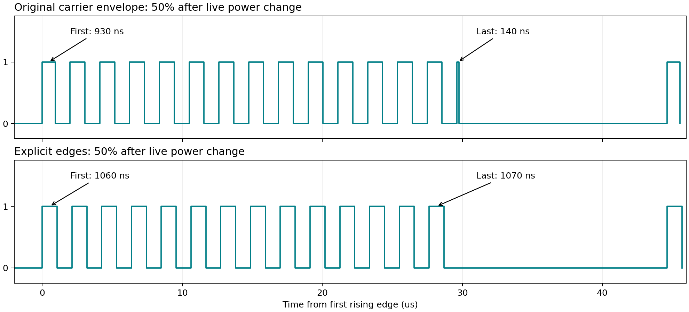

# ESP32-C3 RMT pulse investigation

Measured 2026-09-07 on the user's bare XIAO ESP32-C3, revision v0.4, via COM19.
Saleae Logic16 DB6A5382C6A5ED3A, digital channel 0, 100 MS/s, no glitch filter.
Logic 2 MCP endpoint: http://127.0.0.1:10530. No amplifier PCB was connected.

## Finding

The carrier-envelope implementation can split a carrier high interval between
both ends of a burst. At 50%, one baseline capture contains 15 highs instead of
14: about 925 ns first, 13 full highs, then about 138 ns last. The two partial
highs sum to approximately the configured 1062.5 ns. The split is stable within
a capture, but depends on transmission history: changing away and back can give
a different split, or complete pulses. Thus the earlier 250 ns and 625 ns values
are not uniquely determined by the requested power.

This strongly supports a carrier/envelope alignment problem. It does not establish
which internal hardware counter or synchronization path causes the misalignment.
It also corrects the earlier soft-start interpretation: the observed waveform
redistributes high time to both burst boundaries, rather than simply reducing it.
Electrical energy or amplifier stress cannot be inferred from this GPIO test.



At 75%, the current generator requests 35 pulses (the earlier conversational
count of 34 was an arithmetic error). At 77% it requests 38. The baseline can
instead show 39, including the two partial highs.

## Experiments

| Implementation | Result |
| --- | --- |
| Committed carrier envelope | Reproduced partial first and last pulses after live changes |
| Explicit 85-clock highs and explicit lows; carrier disabled | Clean pulses in all tested fitting patterns |
| Disable/re-enable carrier before transmission | Still produces partial pulses |
| Carrier always-on setting | Still produces partial pulses |
| Uninstall/reinstall RMT driver before transmission | Still produces partial pulses |
| Peripheral reset plus reinitialization | Not reliable across patterns and transitions |

All failed experiments were removed from the working implementation.

## Retained diagnostic build

`seeed_xiao_esp32c3_rmt_explicit` defines `RFGEN_ESP32C3_RMT_EXPLICIT_PULSES`.
One item encodes one 85-clock high plus the remainder of its period low, including
any blank. One RAM word remains reserved for the loop terminator. The current
30-80% tables and the continuous 100% table fit; 81-99% fall back to the original
carrier-envelope encoding. The fallback still has the defect: the final 99%
capture showed 513 highs instead of 512, with partial boundary pulses.

The ordinary build does not define the diagnostic flag and retains its original
encoding and transmit sequence. This is an A/B diagnostic, not a full-range fix.

```powershell
pio run -e seeed_xiao_esp32c3_rmt_explicit -t upload --upload-port COM19
python tools/rmt_capture.py --port COM19 --device DB6A5382C6A5ED3A experiment1 50 75 77 50 100 0
```

The script requires pyserial, uses channel 0 at 100 MS/s, saves CSV and .sal
captures, and writes pulse-width histograms under `.pio/rmt-captures/`. Use a new
label each time. It leaves the last requested power active; append 0 for off.
Capture timing can exceed the requested duration due to device/software buffering;
reported counts are computed from exported samples, not assumed capture duration.

## Validation

- Randomized sweep of every integer power 30-80%, then 100%, 50%, 77%, 75%, off:
  56 captures, 2,845,435 complete measured highs, all 1060 or 1070 ns.
  The sample interval is 10 ns; this is consistent with the nominal 1062.5 ns.
- Final build: 81 -> 50 -> 99 -> 77 -> 100 -> off -> 50. Explicit patterns remain
  clean after switching from carrier fallback; off produces no edges.
- Normal and experimental XIAO builds succeed; flash writes verified by esptool.
- Existing native suite: 9/9 tests pass. These cover the common generator and
  state transitions, not hardware carrier timing.
- Hardware timing validation was on the C3 only. No S3 validation was performed.
- Captures measure settled repeating bursts, not the immediate software handoff
  gap or every startup transient.

Raw investigation captures and experimental source snapshots remain locally in
`.pio/rmt-investigation/` (Git-ignored). Relevant evidence: `baseline2-50`,
`explicit-50`, `sweep.json`, and `final.json`. Repeated powers in early exploratory
runs reused paths, retaining the last capture; the sweep and final run have unique
sequence-numbered paths. The accompanying chart uses the retained last captures.

The board is left running the diagnostic firmware at 50%, with its review capture
loaded in Logic 2. No commit was created.
